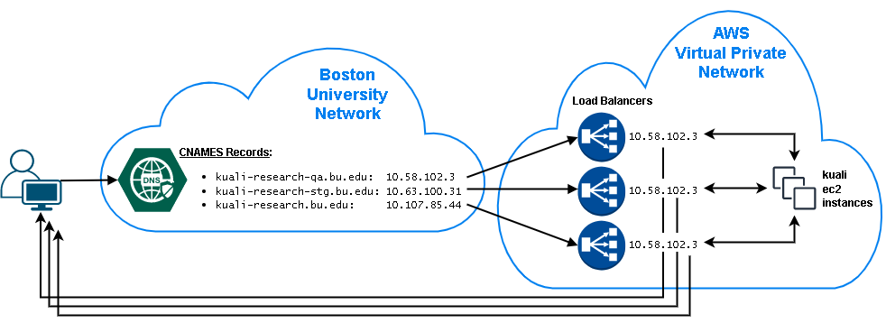
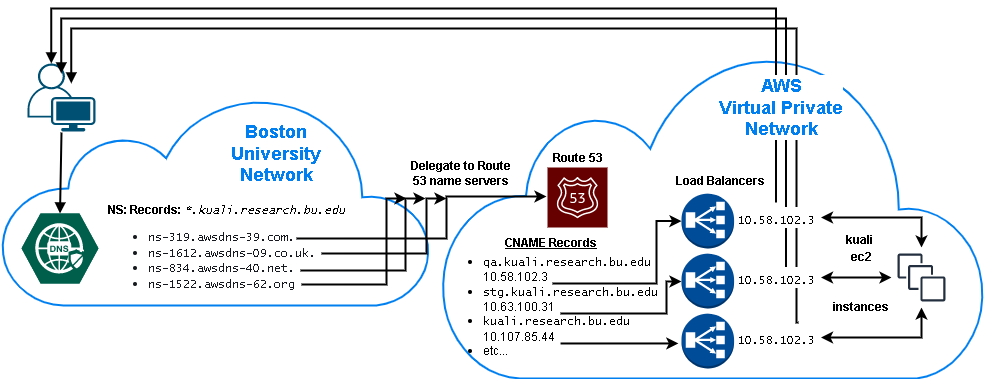

## Hosted Zones for Kuali Research

This cloud-formation stack introduces the aws [Route 53 service](https://docs.aws.amazon.com/Route53/latest/DeveloperGuide/Welcome.html) into the kuali application stack for the purpose of transferring most of the [dns](https://en.wikipedia.org/wiki/Domain_Name_System) routing away from the Boston University servers to the cloud account where the application is deployed. This way, sub-domains can be provisioned on the fly during stack creation and thus an unlimited number of environments are possible.

**Legacy Setup:** 
Application load balancers for the service are one of the primary ingress points for access to the kuali application servers.
In the older setup, the addresses of these load balancers was registered directly with the BU [dns](https://en.wikipedia.org/wiki/Domain_Name_System) server(s).
Each environment would have it's own domain and any additional environment would only be possible after a service ticket for networking to create another [dns cname record](https://support.dnsimple.com/articles/cname-record/)  to route to the aws load balancer for that environment.
This setup is depicted below:

**Dynamic Setup:**

The improvements in this setup focus on shifting most of the name to address resolution of [dns](https://en.wikipedia.org/wiki/Domain_Name_System) to [route 53](https://docs.aws.amazon.com/Route53/latest/DeveloperGuide/Welcome.html).
The BU dns server(s) role is reduced down to having a single wild-carded entry. Any traffic whose addressing matches the wild-card is sent through [route 53](https://docs.aws.amazon.com/Route53/latest/DeveloperGuide/Welcome.html) for the remainder of the name resolution.

Since [route 53](https://docs.aws.amazon.com/Route53/latest/DeveloperGuide/Welcome.html) can have records added dynamically to the [hosted zone](https://docs.aws.amazon.com/Route53/latest/DeveloperGuide/AboutHZWorkingWith.html) designated for "`*`.kuali.research.bu.edu" by cloud formation during creation of an application stack, no ticketing or cross-department coordination is necessary to create the [dns](https://en.wikipedia.org/wiki/Domain_Name_System) routing for that new environment.
Also, the "`*`" portion of the "`*`.kuali.research.bu.edu" can be substituted with any environment name.
The setup is depicted below:



If run without parameters, this stack will produce a hosted zone with two primary records having default values:

- Application: `"kuali.research.bu.edu"`
- Database: `"db.kuali.research.bu.edu"`

Further records added will be for subdomains, ie: `"myenvironment.kuali.research.bu.edu"`

### Prerequisites:

- **AWS CLI:** 
  If you don't have the AWS command-line interface, you can download it here:
  [https://docs.aws.amazon.com/cli/latest/userguide/install-cliv2.html](https://docs.aws.amazon.com/cli/latest/userguide/install-cliv2.html)

- **IAM User/Role:**
  The cli needs to be configured with the [access key ID and secret access key](https://docs.aws.amazon.com/general/latest/gr/aws-sec-cred-types.html#access-keys-and-secret-access-keys) of an (your) IAM user. This user needs to have a role with policies sufficient to cover all of the actions to be carried out (stack creation, VPC/subnet read access, ssm sessions, secrets manager read/write access, etc.). Preferably your user will have an admin role and all policies will be covered.

- **Bash:**
  You will need the ability to run bash scripts. Natively, you can do this on a mac, though there may be some minor syntax/version differences that will prevent the scripts from working correctly. In that event, or if running windows, you can either:

  - Clone the repo on a linux box (ie: an ec2 instance), install the other prerequisites and run there.
  - Download [gitbash](https://git-scm.com/downloads)

- **S3 Bucket**:
  This S3 Bucket must exist prior to stack creation and serves 2 purposes:

  1. You must specify (either by default or explicit entry) an S3 bucket location where the yaml template(s) are to be uploaded and referenced as a parameter for stack creation. The bucket currently defaults to the following:

     ```
     s3://kuali-conf/cloudformation/kuali_dns
     ```

     *NOTE: (There is an example of specifying a different s3 location below)*

### Steps:

Included is a bash helper script (main.sh) that serves to simplify many of the command line steps that would otherwise include a fair amount of manual entry. 

1. **Clone this repository**:

   ```
   git clone https://github.com/bu-ist/kuali-infrastructure.git
   cd kuali-infrastructure/kuali_dns
   ```

2. **Create the stack:**
   Use the main.sh helper script to create the jenkins cloudformation stack.
   Examples:

   - Accept all defaults, perform as a dryrun to see the command(s) without running them:

     ```
     sh main.sh dryrun=true
     ```

   - Override application and/or database domain names with specific values.

     ```
     sh main.sh domain_name=kuali2.research.bu.edu db_domain_name=db.kuali2.research.bu.edu
     ```

     
