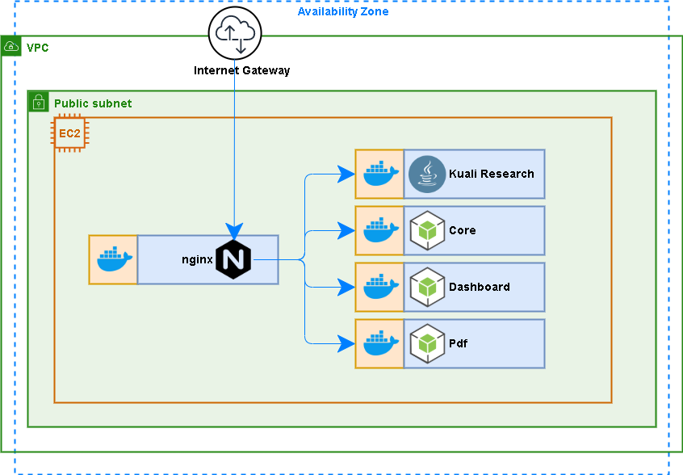

## Kuali Research Single EC2 instance creation

Use this template to perform the simplest form of deployment for kuali research, a single publicly addressable ec2 instance application host.
    


### Features:

1. **EC2:**
   A single EC2 instance running in the default VPC with a public DNS address.
2. **Docker:**
   Part of EC2 initialization includes starting up docker containers for kc, core, dashboard and pdf modules.
3. **Nginx:**
   Reverse proxying is accomplished with an additional docker container running nginx that takes in all traffic coming into the ec2 instance over ports 80 (http) and 443 (https) and routes to the appropriate app in one of the other docker containers.
4. **Cloudformation:**
   Create, update, or delete the cloud formation stack for the infrastructure and app deployment.
   Resources created are the EC2 instance (with profile, role, security group, log group, & elastic IP) as shown below.
       

### Prerequisites:

- **AWS CLI:** 
  If you don't have the AWS command line interface, you can download it here:
  [https://docs.aws.amazon.com/cli/latest/userguide/install-cliv2.html](https://docs.aws.amazon.com/cli/latest/userguide/install-cliv2.html)
- **IAM User/Role:**
  The cli needs to be configured with the [access key ID and secret access key](https://docs.aws.amazon.com/general/latest/gr/aws-sec-cred-types.html#access-keys-and-secret-access-keys) of an (your) IAM user. This user needs to have a role with policies sufficient to cover all of the actions to be carried out (ECR access, stack creation, certificate upload, ssm sessions, etc.). Preferably your user will have an admin role and all policies will be covered.
- **Bash:**
  You will need the ability to run bash scripts. Natively, you can do this on a mac, though there may be some minor syntax/version differences that will prevent the scripts from working correctly. In that event, or if running windows, you can either:
  - Clone the repo on a linux box (ie: an ec2 instance), install the other prerequisites and run there.
  - Download [gitbash](https://git-scm.com/downloads)
- **Docker Images:**
  Before creating the cloudformation stack, it is assumed that each Docker image (kc, core, dashboard, pdf) has already been built and uploaded to their respective repositories in the elastic container registry of you account.

<IFrame src="../notes/prerequisites.md"></IFrame>

### Steps:

Included is a bash helper script (main.sh) that serves to simplify many of the command line steps that would otherwise include a fair amount of manual entry. 

1. **Clone this repository**

   ```
   git clone https://github.com/bu-ist/kuali-cloudformation.git
   cd kuali-cloudformation/kuali_ec2
   ```

2. **Create the stack**

   ```
   # Example 1) Create the stack with all the default values
   sh main.sh create-stack
   
   # Example 2) Create the stack with numerous parameters overridden parameters
   sh main.sh create-stack
     stack_name=my-standalone-ec2-stack \
     global_tag=my-standalone-ec2 \
     ec2_instance_type=m5.large \
     kc_image=730096353738.dkr.ecr.us-east-1.amazonaws.com/coeus-sandbox:2001.0040 \
     core_image=730096353738.dkr.ecr.us-east-1.amazonaws.com/core:2001.0040 \
     portal_image=730096353738.dkr.ecr.us-east-1.amazonaws.com/portal:2001.0040 \
     pdf_image=730096353738.dkr.ecr.us-east-1.amazonaws.com/research-pdf:2002.0003
   ```

3. **Browse the app:**
   Once the stack has been created, you can visit the Kuali Research app in your browser.

   1. Go to the stack in the [AWS Console](https://console.aws.amazon.com/cloudformation/home?region=us-east-1). Click on the new stack in the list and go to the "Outputs" tab.
   2. There will be a "PublicDnsName" output. Click on the link it has for a value.
   3. We use a self-signed certificate, so you should be presented with a security warning. Click to proceed despite the warning.
   4. You should now see the app.

4.  **Update the stack:**
   You may need to edit the ec2.yaml template to adjust resources or change parameters. This will require a stack update.
   The method below includes automatically uploading the template to s3.

   ```
   # Scenario 1) One or more templates have changed, but none of the parameters have
   sh main.sh update-stack

   # Scenario 2) A parameter has changed (upgrading kuali-research)
   sh main.sh update-stack \
   	kc_image=730096353738.dkr.ecr.us-east-1.amazonaws.com/coeus-sandbox:2001.0040
   ```
   
5. **Shell into the EC2 instance:**
   Part of stack creation included the generation of a ssh key pair. The public key was assigned to the ec2 instance for the default user (ec2-user).
   You should find the public and private key in the root directory.

   1. Go to the stack in the [AWS Console](https://console.aws.amazon.com/cloudformation/home?region=us-east-1). Click on the new stack in the list and go to the "Outputs" tab.
   2. There will be a "PublicIp" output. Use this value along with the private key as follows.

   ```
   # Private key is: ./kuali-ec2-sb-keypair
   # PublicIp is: 50.16.77.11
   ssh -i kuali-ec2-sb-keypair ec2-user@50.16.77.11
   ```

   