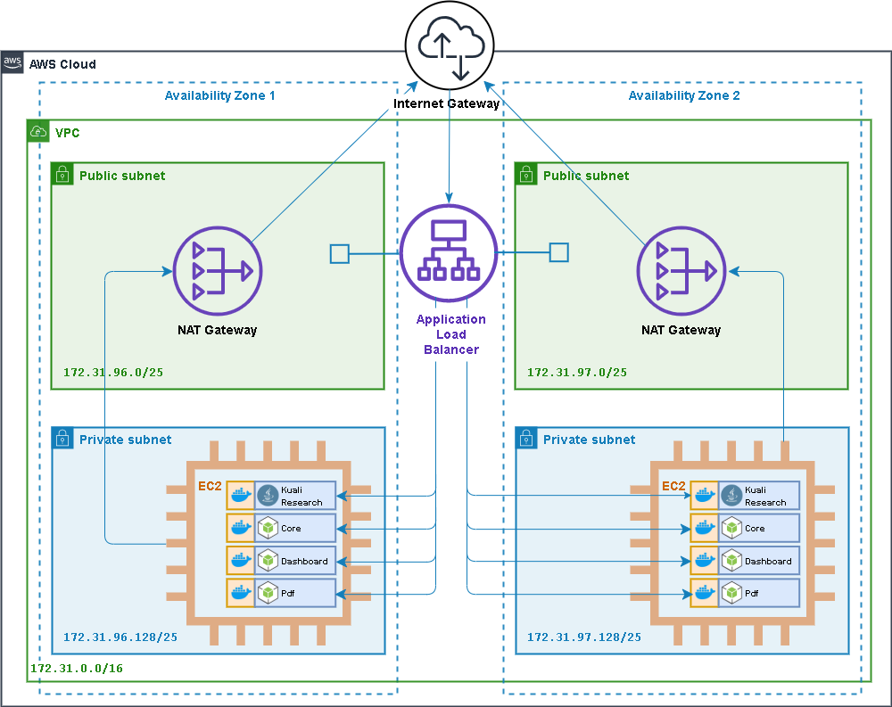

## Kuali Research dual load-balanced EC2 instance creation

Use these template to perform the median form of deployment for kuali research, two ec2 instances sitting behind a load balancer.

### Features:

1. **EC2:**
   Two EC2 instances each running in it's own private subnet, each in a separate availability zone (accomplishes high(er) availability).
2. **Docker:**
   Part of EC2 initialization includes starting up docker containers for kc, core, dashboard and pdf modules.
3. **Application Load Balancer:**
   [Reverse proxying](https://medium.com/commutatus/how-to-configure-a-reverse-proxy-in-aws-b164de91176e) is accomplished through the [application load balancer](https://docs.aws.amazon.com/elasticloadbalancing/latest/application/introduction.html) that takes in all traffic bound for the ec2 instances over ports 80 (http) and 443 (https) and routes according to path-based rules to the appropriate ports on the EC2 hosts . The corresponding docker container is published on the appropriate ec2 host port. This removes the need for an [apache ](https://httpd.apache.org/docs/2.4/howto/reverse_proxy.html) or [nginx reverse proxy](https://docs.nginx.com/nginx/admin-guide/web-server/reverse-proxy/) running inside the ec2 host.
4. **Cloudformation:**
   Create, update, or delete the cloud formation stack for the infrastructure and app deployment.
   Resources created are the EC2 instance (with profile, role, security group, log group, & application load balancer) as shown below.




### Prerequisites:

- **AWS CLI:** 
  If you don't have the AWS commandline iterface, you can download it here:
  [https://docs.aws.amazon.com/cli/latest/userguide/install-cliv2.html](https://docs.aws.amazon.com/cli/latest/userguide/install-cliv2.html)
- **IAM User/Role:**
  The cli needs to be configured with the [access key ID and secret access key](https://docs.aws.amazon.com/general/latest/gr/aws-sec-cred-types.html#access-keys-and-secret-access-keys) of an (your) IAM user. This user needs to have a role with policies sufficient to cover all of the actions to be carried out (ECR access, stack creation, certificate upload, ssm sessions, etc.). Preferably your user will have an admin role and all policies will be covered.
- **Bash:**
  You will need the ability to run bash scripts. Natively, you can do this on a mac, though there may be some minor syntax/version differences that will prevent the scripts from working correctly. In that event, or if running windows, you can either:
  - Clone the repo on a linux box (ie: an ec2 instance), install the other prerequisites and run there.
  - Download [gitbash](https://git-scm.com/downloads)
- **Docker Images:**
  Before creating the cloudformation stack, it is assumed that each Docker image (kc, core, dashboard, pdf) has already been built and uploaded to their respective repositories in the elastic container registry of you account.


### Steps:

Included is a bash helper script (main.sh) that serves to simplify many of the command line steps that would otherwise include a fair amount of manual entry. 

2. **Clone this repository**
  
```
   git clone https://github.com/bu-ist/kuali-cloudformation.git
   cd kuali-cloudformation/kuali_ec2
```

2. **Certificate creation:**
   The load balancer will be configured to redirect all http traffic to https. This means that it needs to have an ssl certificate to decrypt all incoming traffic on port 443 before forwarding on to the application hosts. You may already have a certificate uploaded to IAM or ACM.
   However, you can also call this script to create and upload a self-signed certificate for you:

   1. Generates certificate
   2. Imports certificate to IAM
   3. Uploads certificate file, private key file, and the ARN of the imported certificate to an S3 bucket.

   ```
   # Example 1): Certificate will be uploaded to "s3://kuali-research-ec2-setup/cloudformation/kuali_ec2_alb"
   sh main.sh cert
   
   # Example 2): Upload certificate to another bucket path (bucke will be created if it does not already exist).
   sh main.sh cert bucket_path=s3://my_bucket/some/directory
   ```

   *IMPORTANT: When creating the stack, for some reason cloudformation returns a "CertificateNotFound" error when the arn of a certificate uploaded to ACM is used to configure the listener for ssl. However, it has no problem with an arn of uploaded iam server certificates. This may have something to do with the self-signed certificates being considered invalid. Put your certificates (at least, your self-signed certificates) in IAM for now until more is known about the issue.*

3. **Create the stack:**
   The creation of the cloudformation stack can be run in one of two ways:

   1. **Default:**
      All subnets will be created from scratch inside the default VPC with its internet gateway. The ids of the default VPC and internet gateway need not be provided as these can be dynamically looked up.

      ```
      # Example 1): Create the stack in the default vpc, with new subnets. Create the S3 bucket with default name if not exists:
      # s3://kuali-research-ec2-setup/cloudformation/kuali_ec2_alb"
      # If the certificate was created & imported earlier, no need to provide its ARN (can be dynamically looked up)
      sh main.sh create-stack
      
      # Example 2): Same as scenario 1, except the certificate already existed:
      sh main.sh create-stack \
      	certificate_arn=arn:aws:iam::730096353738:server-certificate/kuali-ec2-alb-cert \
          kc_image=730096353738.dkr.ecr.us-east-1.amazonaws.com/coeus-sandbox:2001.0040 \
          core_image=730096353738.dkr.ecr.us-east-1.amazonaws.com/core:2001.0040 \
          portal_image=730096353738.dkr.ecr.us-east-1.amazonaws.com/portal:2001.0040 \
          pdf_image=730096353738.dkr.ecr.us-east-1.amazonaws.com/research-pdf:2002.0003
          
      ```
   # Example 3): Same as scenario 1, except create/use a custom S3 bucket, and overrides default ec2 instance size
      sh main.sh create-stack \
      	bucket_path=s3://my_bucket/some/directory \
      	ec2_instance_type=m4.xlarge \
          kc_image=730096353738.dkr.ecr.us-east-1.amazonaws.com/coeus-sandbox:2001.0040 \
          core_image=730096353738.dkr.ecr.us-east-1.amazonaws.com/core:2001.0040 \
          portal_image=730096353738.dkr.ecr.us-east-1.amazonaws.com/portal:2001.0040 \
          pdf_image=730096353738.dkr.ecr.us-east-1.amazonaws.com/research-pdf:2002.0003
          
      # Example 4) Same as scenario 1, except overriding default availability zones of us-east-1a and us-east-1b
      sh main.sh create-stack \
      	availability_zone1=us-west-1a \
      	availability_zone2=us-west-1b \
          kc_image=730096353738.dkr.ecr.us-east-1.amazonaws.com/coeus-sandbox:2001.0040 \
          core_image=730096353738.dkr.ecr.us-east-1.amazonaws.com/core:2001.0040 \
          portal_image=730096353738.dkr.ecr.us-east-1.amazonaws.com/portal:2001.0040 \
          pdf_image=730096353738.dkr.ecr.us-east-1.amazonaws.com/research-pdf:2002.0003
   
      # Example 5) Comprehensive parameters, avoiding all defaults.
      	landscape=ci \
          stack_name=my-kuali-with-ALB \
          global_tag=my-kuali-alb-ec2 \
          ec2_instance_type=m5.large \
      	availability_zone1=us-west-1a \
      	availability_zone2=us-west-1b \
      	bucket_path=s3://my_bucket/some/directory \
      	certificate_arn=arn:aws:iam::730096353738:server-certificate/kuali-ec2-alb-cert \
          kc_image=730096353738.dkr.ecr.us-east-1.amazonaws.com/coeus-sandbox:2001.0040 \
          core_image=730096353738.dkr.ecr.us-east-1.amazonaws.com/core:2001.0040 \
          portal_image=730096353738.dkr.ecr.us-east-1.amazonaws.com/portal:2001.0040 \
          pdf_image=730096353738.dkr.ecr.us-east-1.amazonaws.com/research-pdf:2002.0003
      ```
      
   2. **"Injected":**
   This scenario assumes that you are "injecting" the load balancer and ec2 instances into subnets that have already been set aside for them, perhaps by network administrators, cloud team, etc.
   
      ```
      # Example 1): Create the infrastructure in a specific VPC using existing subnets:
      sh main.sh \
          vpc_id=vpc-abdf0ccc \
          internet_gateway_id=igw-3c621958 \
          private_subnet1=subnet-07e780de2660d726d \
          private_subnet2=subnet-0a14cd05d7e822b8a \
          public_subnet1=subnet-01b7baf7ed9fe8b4e \
          public_subnet2=subnet-0ed0feaf1187d9ed9 \

      ```
   
      ```
   
4. **Browse the app:**
   Once the stack has been created, you can visit the Course Schedule Planner app in your browser.

   1. Go to the stack in the [AWS Console](https://console.aws.amazon.com/cloudformation/home?region=us-east-1). Click on the new stack in the list and go to the "Outputs" tab.
   2. There will be an "LoadBalancerUrl" output. Click on the link it has for a value.
   3. If you used a self-signed certificate, you should be presented with a security warning. Click to proceed despite the warning.
   4. You should now see the app.

5. **Update the stack:**
   You may decide to modify the stack to add, remove, or adjust resources.
   For example, there is currently no logging for the app, so adding cloudwatch log group and metrics and docker logging driver may be something to do soon.

   ```
   # Modify 1 or more yaml templates, but no new/modified parameters
   # then...
   sh main.sh update-stack
   
   # The templates may not have changed, changing parameters to up the ec2 instance size and upgrade kuali-research to new release:
   sh main.sh update-stack \
   	ec2_instance_type=m4.xlarge \
   	kc_image=730096353738.dkr.ecr.us-east-1.amazonaws.com/coeus-sandbox:2006.0038
   ```

6. **Shell access:**
   Occasionally, log information is insufficient to determine the cause of an issue and it becomes necessary to shell into the application host to "poke around". However, for security reasons, the 2 ec2 instances reside in private subnets, and are protected from any access from the outside world that does not go through the load balancer.
        
   Traditionally, the way to accommodate access to the private subnet was to place another ec2 instance in the public subnet to act as a bastion or "jump" server. You'd have to know what you are doing in order to harden up the bastion server to ensure that it limited access properly and did not expose security holes.
       
   More recently, another option has been made available through the [AWS Systems Manager service](https://console.aws.amazon.com/systems-manager/home?region=us-east-1#).
   For full details at: [Toward a bastion-less world](https://aws.amazon.com/blogs/infrastructure-and-automation/toward-a-bastion-less-world/).
   Through this service you can start a session into either of the two application hosts:

   1. Start a session in your browser by navigating to the [Session Manager](https://console.aws.amazon.com/systems-manager/session-manager/sessions?region=us-east-1) in the AWS console.
      Click "Start Session", and you should see the two ec2 instances in the list of ec2 instances with which a session can be created.

   2. Use your command line:

      ```
      aws ssm start-session --target [paste ec2 instance id here]
      ```

   With this method, shell access moves away from using key pairs, and toward using the access key ID and secret access key of your IAM user.

   - Your IAM user must have a policy that grants ssm access.
   - The ec2 instance itself acts as a client of the SSM session service and must have a profile that uses a role with policies that grant this.
     You can see these in the ec2.yaml template:
     - AmazonSSMManagedInstanceCore
     - CloudWatchAgentServerPolicy