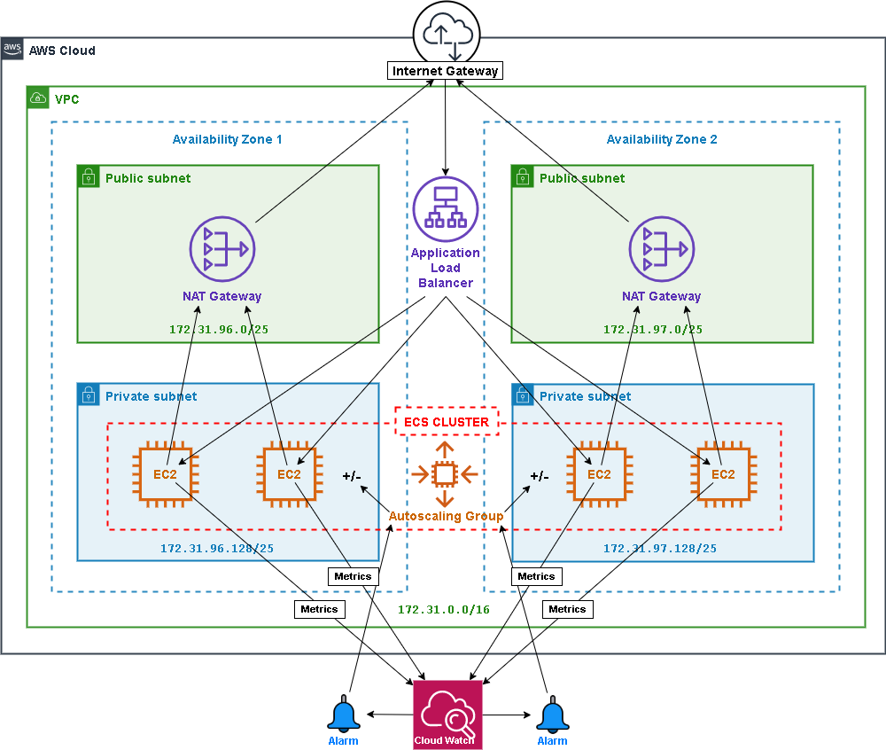

## Kuali Research Elastic Container Services (ECS) Cluster Creation

Use these template to build an AWS cloud formation stack where all Kuali research modules are hosted through elastic container services (ECS).




### Features:

1. **Auto Scaling:**
   Much of the direct control of docker containers and the EC2 instances they run on is ceded to the elastic container service which creates and destroys these items dynamically in response to changes in load determined from logged metrics of resource consumption on the application host servers.
2. **Application Load Balancer:**
   [Reverse proxying](https://medium.com/commutatus/how-to-configure-a-reverse-proxy-in-aws-b164de91176e) is accomplished through the [application load balancer](https://docs.aws.amazon.com/elasticloadbalancing/latest/application/introduction.html) that takes in all traffic bound for the ec2 instances over ports 80 (http) and 443 (https) and routes according to path-based rules to the appropriate ports on the EC2 hosts . The corresponding docker container is published on the appropriate ec2 host port. This removes the need for an [apache ](https://httpd.apache.org/docs/2.4/howto/reverse_proxy.html) or [nginx reverse proxy](https://docs.nginx.com/nginx/admin-guide/web-server/reverse-proxy/) running inside the ec2 host.
3. **Lifecycle Hook:**
   A lifecycle hook enables the gradual removal of EC2 instances due to maintenance or scale-downs so as to prevent abrupt interuption in the operation of whatever tasks may be running on them and allow a graceful transition. 
   Link: [How to Automate Container Instance Draining in Amazon ECS](https://aws.amazon.com/blogs/compute/how-to-automate-container-instance-draining-in-amazon-ecs/)
4. **Cloudformation:**
   Create, update, or delete the cloud formation stack for the infrastructure and app deployment.
   Resources created are the ECS cluster (with VPC, instances, roles, security groups, log groups, & application load balancer) as shown above.
   

### Prerequisites:

- **AWS CLI:** 
  If you don't have the AWS commandline iterface, you can download it here:
  [https://docs.aws.amazon.com/cli/latest/userguide/install-cliv2.html](https://docs.aws.amazon.com/cli/latest/userguide/install-cliv2.html)
- **IAM User/Role:**
  The cli needs to be configured with the [access key ID and secret access key](https://docs.aws.amazon.com/general/latest/gr/aws-sec-cred-types.html#access-keys-and-secret-access-keys) of an (your) IAM user. This user needs to have a role with policies sufficient to cover all of the actions to be carried out (ECR access, stack creation, certificate upload, ssm sessions, etc.). Preferably your user will have an admin role and all policies will be covered.
- **Bash:**
  You will need the ability to run bash scripts. Natively, you can do this on a mac, though there may be some minor syntax/version differences that will prevent the scripts from working correctly. In that event, or if running windows, you can either:
  - Clone the repo on a linux box (ie: an ec2 instance), install the other prerequisites and run there.
  - Download [gitbash](https://git-scm.com/downloads)
- **Docker Images:**
  Before creating the cloudformation stack, it is assumed that each Docker image (kc, core, dashboard, pdf) has already been built and uploaded to their respective repositories in the elastic container registry of you account.
- **S3 Bucket**
  This S3 Bucket must exist prior to stack creation and serves 2 purposes:
  1. You must specify (either by default or explicit entry) an S3 bucket location where the yaml template(s) are to be uploaded and referenced as a parameter for stack creation.
  2. In this same bucket must exist application configuration files, like kc-config.xml for the research app, and environment variable files for docker containers to reference (contain database connection details and other app parameters).
        

### Steps:

Included is a bash helper script (main.sh) that serves to simplify many of the command line steps that would otherwise include a fair amount of manual entry. 

1. **Clone this repository**:

```
   git clone https://github.com/bu-ist/kuali-infrastructure.git
   cd kuali-infrastructure/kuali_ecs
```

2. **Certificate creation:**
   The load balancer will be configured to redirect all http traffic to https. This means that it needs to have an ssl certificate to decrypt all incoming traffic on port 443 before forwarding on to the application hosts. You may already have a certificate uploaded to IAM or ACM.
   However, you can also call this script to create and upload a self-signed certificate for you:

   1. Generates certificate
   2. Imports certificate to IAM
   3. Uploads certificate file, private key file, and the ARN of the imported certificate to an S3 bucket.

   ```
   # Example 1): Certificate will be uploaded to "s3://kuali-conf/cloudformation/kuali_ecs"
   sh main.sh cert
   
   # Example 2): Upload certificate to another bucket path (bucke will be created if it does not already exist).
   sh main.sh cert bucket_path=s3://my_bucket/some/directory
   ```

   *IMPORTANT: When creating the stack, for some reason cloudformation returns a "CertificateNotFound" error when the arn of a certificate uploaded to ACM is used to configure the listener for ssl. However, it has no problem with an arn of uploaded iam server certificates. This may have something to do with the self-signed certificates being considered invalid. Put your certificates (at least, your self-signed certificates) in IAM for now until more is known about the issue.*

3. **Create the stack:**
   Use the helper script (main.sh) to create the cloudformation stack:

   ```
   # Example 1) Use defaults:
   sh main.sh create-stack
   
   # Example 2) Comprehensive parameters, avoiding all defaults.
       landscape=ci \
       stack_name=my-kuali-with-autoscaling \
       no_rollback=true \
       global_tag=my-kuali-ecs \
       ec2_instance_type=m5.large \
       availability_zone1=us-west-1a \
       availability_zone2=us-west-1b \
       bucket_path=s3://my_bucket/some/directory \
       certificate_arn=arn:aws:iam::770203350335:server-certificate/kuali-ecs-cert \
       kc_image=770203350335.dkr.ecr.us-east-1.amazonaws.com/kuali-coeus-sandbox:2001.0040 \
       core_image=770203350335.dkr.ecr.us-east-1.amazonaws.com/kuali-core:2001.0040 \
       portal_image=770203350335.dkr.ecr.us-east-1.amazonaws.com/kuali-portal:2001.0040 \
       pdf_image=770203350335.dkr.ecr.us-east-1.amazonaws.com/kuali-research-pdf:2002.0003
   ```

   Once you initiate stack creation, you can go to the aws management console and watch the stack creation events as they come in:
   [AWS Management Console - Cloudformation](https://console.aws.amazon.com/cloudformation/home?region=us-east-1)

4. **Monitor stack progress:**
   Go to the stack in the [AWS Console](https://console.aws.amazon.com/cloudformation/home?region=us-east-1). Click on the new stack in the list and go to the "Events" tab.
   Watch for failures (these will show up in red).

5. **Browse the app:**
   Once the stack has been created, you can visit the Course Schedule Planner app in your browser.

   1. Go to the stack in the [AWS Console](https://console.aws.amazon.com/cloudformation/home?region=us-east-1). Click on the new stack in the list and go to the "Outputs" tab.
   2. There will be an "LoadBalancerUrl" output. Click on the link it has for a value.
   3. If you used a self-signed certificate, you should be presented with a security warning. Click to proceed despite the warning.
   4. You should now see the app.

6. **Update the stack:**
   You may decide to modify the stack to add, remove, or adjust resources.
   For example, you may want to adjust the autoscaling desired capacity, or change the subnet CIDR block values.

   ```
   cd kuali_ecs
   
   # Modify 1 or more yaml templates, but no new/modified parameters
   # then...
   sh main.sh update-stack
   
   # The templates may not have changed, but changing parameters here to:
   #   1) change the private subnet CIDR block
   #   2) up the cluster capacity from its default
   #   3) up the ec2 instance size and upgrade kuali-research to new release
   sh main.sh update-stack \
   	private_subnet1=10.0.1.0/25 \
   	private_subnet2=10.0.1.128/25 \
   	min_cluster_size=3 \
   	max_cluster_size=4 \
   	kc_image=770203350335.dkr.ecr.us-east-1.amazonaws.com/kuali-coeus-sandbox:2006.0038
   ```

   Alternatively, you can initiate cluster creation from the aws management console.
   You can either [Update the stack directly](https://docs.aws.amazon.com/AWSCloudFormation/latest/UserGuide/using-cfn-updating-stacks-direct.html), or [Update the stack using a changeset](https://docs.aws.amazon.com/AWSCloudFormation/latest/UserGuide/using-cfn-updating-stacks-direct.html), but if you want AWS to present a prediction of what affects the update will have (particularly deletions) before the update is implemented, then use the changeset.
   In any event, the updates would be written into the template file(s) and re-uploaded to the S3 bucket before starting. The stack update wizard will present you with the option of specifying the S3 url to update the stack or nested stack(s). This would not be necessary if simply updating to implement different parameters.
       
   Upgrades/releases to kuali modules as well as scheduled system maintenance or updates to the EC2 instances in the ECS cluster would be performed through stack updates.


### Upgrades/Patches:

Scenarios (Just jotting down ideas - clean up verbiage and fill out with details later)

- EC2 instances, ie: Newer version of AWS linux ecs-optimized ami is available (possibly with improvements, fixes, vulnerability patches, etc)

- Just update a single service, possibly to redeploy a fix to a docker image, or configurations have changed and you want all tasks service-wide to be restarted (get deleted and replaced) to read in the new configs (ie: environment variables)

  ```
  # Example:
  aws --profile=infnprd ecs update-service --cluster kuali-ecs-sb-cluster --service kuali-ecs-KualiPdfService-1333U12INUWGP-Service-A7O0A14TXCA6 --force-new-deployment
  ```

- Explain why `/etc/cfn/hooks.d/cfn-auto-reloader.conf` and `/opt/aws/bin/cfn-init` works in other stacks for restarting all tasks, but not in ecs cluster.

- Say something about stack updates


### Notes:

The following are some notes and links on general operating principle for certain stack resources, lessons learned along the way, and caveats. 

1. [**Stack Inventory**](stack_inventory.md)
   A breakdown of resources that comprise the stack

2. [**Stack Updates involving EC2 Instances: Info & Gotchas**](../notes/stack-update-gotchas.md)
   A collection of noteworthy points and caveats about EC2 Instances when stack updates apply.

3. [**Notes on Services**](../notes/services.md)
   A few links and noteworthy points encountered while developing the service portion of the ECS cluster stack creation

4. **Lifecycle Hook**
   [How to Automate Container Instance Draining in Amazon ECS](https://aws.amazon.com/blogs/compute/how-to-automate-container-instance-draining-in-amazon-ecs/)
   [NOTES: Lifecycle Hook](..notes/lifecycle-hook.md)

5. **Latest image ID**
   The ECSAMI parameter for the cluster.yaml template has a default that invokes a lookup for the latest ecs-optimized linux ami for ec2 instances to be based on. You can provide a specific image id to override this. However, if you want the latest (recommended), the lookup will fetch for you the same image id as returned by the following CLI call:

   ```
   aws ssm get-parameters --names /aws/service/ecs/optimized-ami/amazon-linux/recommended/image_id --region us-east-1
   ```

   Looking at the special parameter type, you can see what it must be doing:

   ```
   ECSAMI:
       Description: AMI ID
       Type: AWS::SSM::Parameter::Value<AWS::EC2::Image::Id>
       Default: /aws/service/ecs/optimized-ami/amazon-linux-2/recommended/image_id
   ```

6. **Auto-Scaling**
   There are a couple of useful tidbits to know about autoscaling.

   - **EC2 vs Application auto-scaling**
      Two forms of autoscaling come into play with the ECS stack and understanding the difference is helpful.
      EC2 autoscaling is distinct from application auto-scaling employed by the service(s) for ECS. The difference is that EC2 auto-scaling uses properties like MinSize, MaxSize, DesiredCapacity, etc. to refer to the number of EC2 instances need to run in order to meet targets for metric thresholds. ECS auto-scaling uses these properties to refer to docker containers (tasks) and how many of them should be running across the ECS cluster (can span one or more EC2 instances) to meet targets for metric thresholds. Combined, these two auto-scaling types define the overall auto-scaling strategy. This implies a certain amount of orchestration to make sure the two types collaborate with each other instead of clash. SEE: [ec2 vs ecs autoscaling question](https://www.reddit.com/r/aws/comments/5swd80/ec2_vs_ecs_autoscaling_question/)
   - **Auto-scaling group: Signalling EC2 readiness**
      The `AWS::AutoScaling::AutoScalingGroup` resource created in the ECS stack will not go into a `CREATE_COMPLETE` state until enough EC2 instances are heard back from to say they are running. The userdata defined to run on EC2 startup will call the cfn-signal function that comes packaged in the aws optimized ami to signal that the instance is running. We are requiring that a minimum of 1 such signals are received by setting the ECSContainerInstanceAutoScalingGroup.CreationPolicy.ResourceSignal.Count property. Currently the signal is sent upon startup, but it could be made contingent on further conditions written into the EC2 userdata, like a test that a task(s) is running must also succeed (you could send more than one signal and up CreationPolicy.ResourceSignal.Count property correspondingly).

   

   

