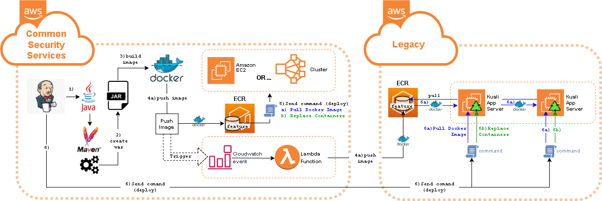

## Kuali build Jenkins job

The jenkins job that builds and deploys kuali research to a selected environment exists on a
ec2-based jenkins host in the CSS (Common security services) aws account.
**Job features:**
   -- Full java/maven build
   -- Creation and uploading of docker image to registry
   -- Deployment/Redeployment of docker image to target application server(s).
   -- Cross-account synchronization of new docker images between registries CSS and "legacy".
   -- Cross-account deployment to target application server(s) in "legacy" account.


### Terms:

- **"CSS"**: Common security services. Refers to 2 aws accounts, production and non-production that provide an for standardized networking and security infrastructure where BU applications can be deployed. Most php applications, and now kuali-research are deployed there.
- **"Legacy"**: This refers to the aws account where kuali research was first deployed to get it off-prem (mostly) and into the cloud.
  We are migrating kuali research from here to the CSS account.

### Directions:

1. #### **Get Jenkins server address:**

   The jenkins server in the CSS account is not associated with any DNS name and must be reached using its IP address.
   Combined with the fact that it is re-creatable through cloud-formation, it's address may change from time to time.
   There are several ways to determine what the jenkins ip address is.

   1. **Email:**
      Check your email history. If you are working with this server, you probably have been sent the most recent url for jenkins.

   2. **EC2 dashboard:** 
      It will be listed in the ec2 dashboard. Login into the non-production CSS account *(770203350335)*. Login and navigate [here](https://console.aws.amazon.com/ec2/v2/home?region=us-east-1#Instances:v=3;search=:jenkins).
      Look for *"Private IPv4 addresses*" under the details tab.

   3. **Cloudformation dashboard:**
      You can find the jenkins server url listed as an output of the cloudformation stack associated with its creation. 
      Login to the non-production CSS account *(770203350335)* and navigate [here](https://console.aws.amazon.com/cloudformation/home?region=us-east-1#/stacks?filteringStatus=active&filteringText=jenkins&viewNested=true&hideStacks=false&stackId=)
      This link will take you to the "Outputs" tab where the entire url is under output "JenkinsPrivateUrl"

   4. **AWS CLI:**
      The jenkins ec2 instance can be looked up by tags, which will always be the same. You can use the aws cli for this.

      ```
      aws ec2 describe-instances --instance-id \
          $(aws resourcegroupstaggingapi get-resources \
            --resource-type-filters ec2:instance \
            --tag-filters 'Key=Function,Values=kuali' 'Key=ShortName,Values=jenkins' \
            --query 'ResourceTagMappingList[].{ARN:ResourceARN}' \
            --output text | cut -d'/' -f2 | sed 's/\n//g') \
       --output text \
       --query 'Reservations[0].Instances[0].{ip:PrivateIpAddress}'
      ```

   Once you have the ip address, plug it in as follows to go directly to the kuali build job:

   ```
   [private jenkins ip]:8080/view/Kuali-Research/job/kuali-research/build?delay=0sec.
   ```

2. #### Run the Job

  The three senior selections of the jenkins job for rebuilding/redploying kuali-research are:
  
  - **STACK**
    This is a tabular listing of completed cloud formation stacks, each of which is selectable by radio button.
    The radio button that is selected indicates an individual landscape that will become the target for deploying an existing version of kuali-research, or a new version once it is built. This is a required selection if performing a feature build.
  - **BUILD_TYPE**
    This selection indicates a phase in a typical release cycle:
    - **Feature**: This is an early stage build that targets a test branch and non-production landscape for testing. The steps taken are:
      1. Pull from a git feature branch
      2. Maven build, resulting in  a war file
      3. Packaging of the war file into a docker image, which is published to a docker feature repository within our registry
      4. Deployment of the newly published docker feature image to the selected landscape stack. This involves sending a command to resources within the stack to purge all related docker containers and images and re-launch new containers based on the new images available in the docker feature repository (these are downloaded).
    - **Pre-release:** This selection indicates readiness to move a feature build into the release category in preparation for the final release. A typical scenario occurs when having finished a feature and you want to move the EXACT build image destined for production out to the staging environment. No building or packaging takes place. The steps taken are:
      1. Pull the image from the feature repository
      2. Rename the image so as to indicate its upcoming new home in the release repository
      3. Push the image to the release repository
      4. Redeploy the release image to a target landscape, if a landscape stack is selected.
    - **Release**: This selection indicates you are performing a final release to the environment you select (this should always be production). The steps taken are:
      1. Redeploy the release image to the target landscape *(this landscape would probably be production, running the prior release).*
  - **GIT_COMMIT_ID**
    This selection indicates exactly what is being built and deployed with respect to the source code.
    You typically set the value here indirectly through the other "GIT_" prefixed parameters. Experiment with these other parameters, and how it works becomes quickly self-explanatory.
  
  An [Event Bridge Rule](https://docs.aws.amazon.com/eventbridge/latest/userguide/eb-rules.html) has been set up as a "listener" for docker registry changes. Any docker image that is pushed to either the feature or release kuali repositories in the current registry is automatically replicated to the corresponding registry in our "legacy" AWS account where one or more landscapes may still be up and running. This involves a lambda function that is triggered to perform the replication if a cloudwatch event for [ECR](https://docs.aws.amazon.com/AmazonECR/latest/userguide/what-is-ecr.html) pushes is detected for kuali. In this way, anything that is built in the current CSS account will be available in for deployment in the "legacy" account. For this reason, there is one other job selection that is worth mentioning:
  
  - **LEGACY_DEPLOY**
    This selection indicates that you additionally want the feature or release indicated by the BUILD_TYPE parameter deployed to the "legacy" landscape that you select.
  
  
  
  

#### EXAMPLES:

------

**Feature build and deploy**

*"I have committed new code to my feature branch "myfeature" in git, and I want to build and deploy the changes to my own test landscape "playground"*:


- DRYRUN: Uncheck
- STACK: Select radio button for landscape "playground"
- BUILD_TYPE: "Feature"
- LEGACY_DEPLOY: "None"
- GIT_REF_TYPE: "Branch"
- GIT_REF: "myfeature"
  

**Feature build and dual deploy**

*"I have committed more new code to my feature branch "myfeature" in git, and I want to build and deploy the changes to my own test landscape AND to the staging landscape in the legacy account"*:



- DRYRUN: Uncheck
- STACK: Select radio button for landscape "playground"
- BUILD_TYPE: "Feature"
- LEGACY_DEPLOY: "Staging"
- GIT_REF_TYPE: "Branch"
- GIT_REF: "myfeature"
  

**Pre-Release and deploy**

*"I want to promote "myfeature" to release status and make it available in the staging environment"*:


- DRYRUN: Uncheck
- STACK: Select radio button for landscape "staging"
- BUILD_TYPE: "Pre-release"
- LEGACY_DEPLOY: "None"
- GIT_REF_TYPE: "Branch"
- GIT_REF: "myfeature"
