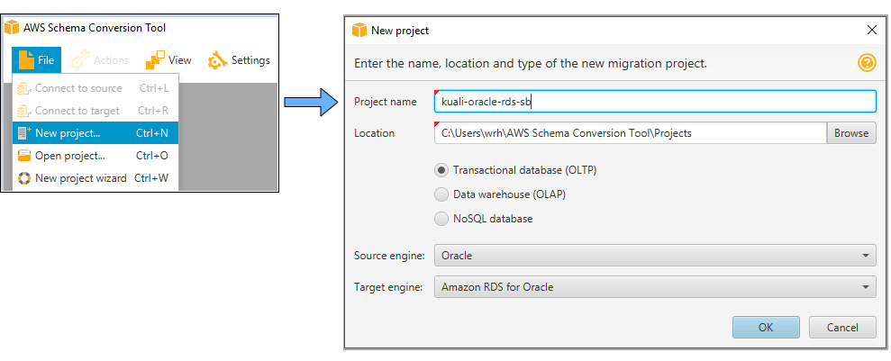
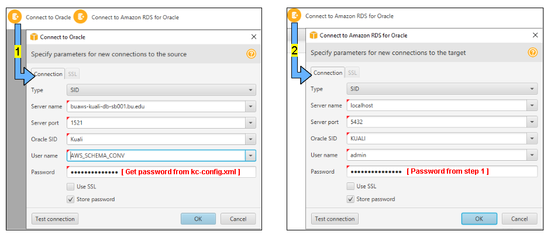

## RDS Schema Creation

Create the kuali "KCOEUS" schema in an empty RDS database.
The [AWS Schema Conversion tool](https://docs.aws.amazon.com/SchemaConversionTool/latest/userguide/CHAP_Welcome.html) is used for this.

### Prerequisites:

- **AWS CLI:** 
  If you don't have the AWS command-line interface, you can download it here:
  [https://docs.aws.amazon.com/cli/latest/userguide/install-cliv2.html](https://docs.aws.amazon.com/cli/latest/userguide/install-cliv2.html)
- **AWS Session Manager Plugin**
  This plugin allows the AWS cli to launch Session Manager sessions with your local SSH client. The Version should be should be at least 1.1.26.0.
  Install instructions: [Install the Session Manager Plugin for the AWS CLI](https://docs.aws.amazon.com/systems-manager/latest/userguide/session-manager-working-with-install-plugin.html)
- **IAM User/Role:**
  The cli needs to be configured with the [access key ID and secret access key](https://docs.aws.amazon.com/general/latest/gr/aws-sec-cred-types.html#access-keys-and-secret-access-keys) of an (your) IAM user. This user needs to have a role with policies sufficient to cover all of the actions to be carried out (stack creation, VPC/subnet read access, ssm sessions, secrets manager read/write access, etc.). Preferably your user will have an admin role and all policies will be covered.
- **Bash:**
  You will need the ability to run bash scripts. Natively, you can do this on a mac, though there may be some minor syntax/version differences that will prevent the scripts from working correctly. In that event, or if running windows, you can either:
  - Clone the repo on a linux box (ie: an ec2 instance), install the other prerequisites and run there.
  - Download [gitbash](https://git-scm.com/downloads)
- **AWS Schema Conversion Tool:**
  This is a desktop app that can be downloaded from this link: [Installing, Verifying, and Updating the AWS Schema Conversion Tool](https://docs.aws.amazon.com/SchemaConversionTool/latest/userguide/CHAP_Installing.html)
- **[SQL Developer](https://www.oracle.com/tools/technologies/whatis-sql-developer.html)** (or similar Oracle database IDE)
  This is a desktop app that can be downloaded from oracle:  [SQL Developer Download](https://www.oracle.com/tools/downloads/sqldev-downloads.html)

### Steps:

1. **Obtain the RDS database password :**
  
   The target RDS database instance will have a master user and password.
   The RDS stack was created along with a secrets-manager secret value containing the users name and the password.
   The username is **"admin"**. To obtain the password, execute the following:
   
   ```
   aws --profile [your.profile] secretsmanager get-secret-value \
       --secret-id kuali/sb/oracle-rds-password \
       --output text \
       --query '{SecretString:SecretString}' \
       | jq '.MasterUserPassword' \
       | sed 's/"//g'
   
   NOTE: If you ever have to delete the secret, this is how:
   aws secretsmanager delete-secret --secret-id kuali/sb/oracle-rds-password --force-delete-without-recovery
   ```
   
2. **Start a tunnel to the RDS Instance on port 5432:**
   Do this in a separate command line window. Allows you to connect to the RDS instance as localhost on port 5432.
   *Full explanation at [Connect to the RDS instance (from your computer)](../../jumpbox/README.md)*

   ```
   # Example:
   git clone https://github.com/bu-ist/kuali-infrastructure.git
   cd kuali-infrastructure/kuali_rds/jumpbox
   sh tunnel.sh profile=[your.profile] landscape=sb
   ```

   

3. **Open The schema Conversion tool and create a new project:** 
       

4. **Create the source and target connections:** 
   *NOTE: "AWS_SCHEMA_CONV" is a user created by our DBA with the required privilege to select from sys.users$.*
   *Without this the tool will fail with: `ORA-01031: insufficient privileges`*
   

5. **Get schema conversion sql:**

   | Tablespace            |                                                              |
   | --------------------- | ------------------------------------------------------------ |
   |  | On the left side of the window will be listed all of the schema objects for the original oracle database.<br /><br />By default, all items will be selected.<br /><br />Uncheck all of the items except for the "KUALI_DATA" tablespace item.<br /><br />Select "Convert schema" from the context menu of the table space item<br /><br />This should cause a corresponding "KUALI_DATA" tablespace item to appear among the left side schema objects for the rds oracle database. |
   |                       |                                                              |
   | **Profile**           |                                                              |
   |                       |                                                              |

6. ssfsfdsfd

   


