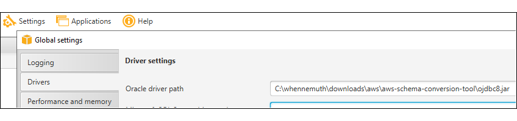
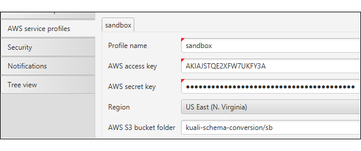
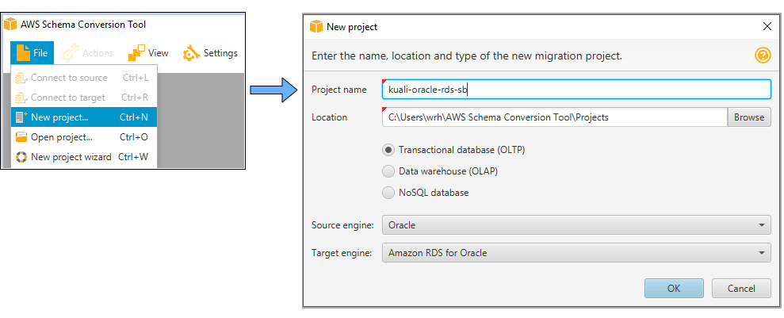
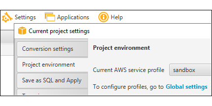
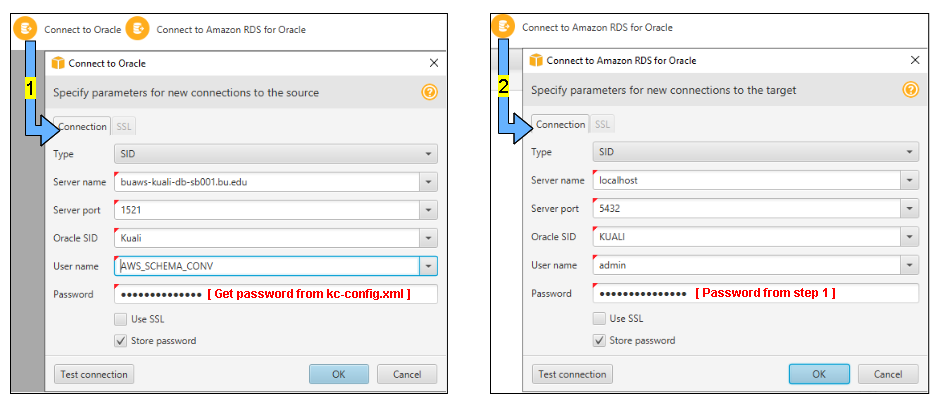
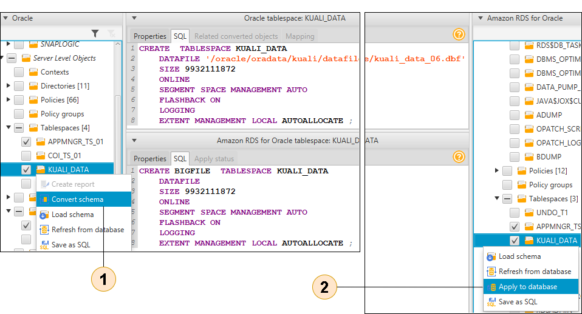

## RDS Schema Creation (Oracle to RDS Oracle)

Create the kuali "KCOEUS" schema in an empty RDS database.
The [AWS Schema Conversion tool](https://docs.aws.amazon.com/SchemaConversionTool/latest/userguide/CHAP_Welcome.html) is used for this. *[Reference documentation: [Oracle to RDS Oracle](https://docs.aws.amazon.com/SchemaConversionTool/latest/userguide/CHAP_Source.Oracle.ToRDSOracle.html)]*


### Prerequisites:

- **AWS CLI:** 
  If you don't have the AWS command-line interface, you can download it here:
  [https://docs.aws.amazon.com/cli/latest/userguide/install-cliv2.html](https://docs.aws.amazon.com/cli/latest/userguide/install-cliv2.html)
- **AWS Session Manager Plugin**
  This plugin allows the AWS cli to launch Session Manager sessions with your local SSH client. The Version should be should be at least 1.1.26.0.
  Install instructions: [Install the Session Manager Plugin for the AWS CLI](https://docs.aws.amazon.com/systems-manager/latest/userguide/session-manager-working-with-install-plugin.html)
- **IAM User/Role:**
  The cli needs to be configured with the [access key ID and secret access key](https://docs.aws.amazon.com/general/latest/gr/aws-sec-cred-types.html#access-keys-and-secret-access-keys) of an (your) IAM user. This user needs to have a role with policies sufficient to cover all of the actions to be carried out (stack creation, VPC/subnet read access, ssm sessions, secrets manager read/write access, etc.). Preferably your user will have an admin role and all policies will be covered.
- **Bash:**
  You will need the ability to run bash scripts. Natively, you can do this on a mac, though there may be some minor syntax/version differences that will prevent the scripts from working correctly. In that event, or if running windows, you can either:
  - Clone the repo on a linux box (ie: an ec2 instance), install the other prerequisites and run there.
  - Download [gitbash](https://git-scm.com/downloads)
- **AWS Schema Conversion Tool:**
  This is a desktop app that can be downloaded from this link: [Installing, Verifying, and Updating the AWS Schema Conversion Tool](https://docs.aws.amazon.com/SchemaConversionTool/latest/userguide/CHAP_Installing.html)
- **[SQL Developer](https://www.oracle.com/tools/technologies/whatis-sql-developer.html)** (or similar Oracle database IDE)
  This is a desktop app that can be downloaded from oracle:  [SQL Developer Download](https://www.oracle.com/tools/downloads/sqldev-downloads.html)
- **Oracle Driver:**
  The schema conversion tool requires the ojdbc.jar driver in order to run against an oracle database: [Oracle JDBC Driver 8](https://repo1.maven.org/maven2/com/oracle/database/jdbc/ojdbc8/)


### Steps:

1. #### Obtain the RDS database password :
  
   The target RDS database instance will have a master user and password.
   The RDS stack was created along with a secrets-manager secret value containing the users name and the password.
   The username is **"admin"**. To obtain the password, execute the following:
   
   ```
   # Example:
   git clone https://github.com/bu-ist/kuali-infrastructure.git
   cd kuali-infrastructure/kuali_rds
   sh main.sh get-password landscape=ci profile=default
   
   # NOTE: If you ever have to delete the secret, this is how:
   aws secretsmanager delete-secret --secret-id kuali/sb/kuali-oracle-rds-admin-password --force-delete-without-recovery
   ```
   
   
   
2. #### Start a tunnel to the RDS Instance on port 5432:
  
   Do this in a separate command line window. Allows you to connect to the RDS instance as localhost on port 5432.
*Full explanation at [Connect to the RDS instance (from your computer)](../../jumpbox/README.md)*
   
   ```
   # Example:
   git clone https://github.com/bu-ist/kuali-infrastructure.git
   cd kuali-infrastructure/kuali_rds/jumpbox
   sh tunnel.sh profile=[your.profile] landscape=sb
   ```


​      

3. #### Open the Schema Conversion tool and configure:

   Download the oracle driver from [here](https://repo1.maven.org/maven2/com/oracle/database/jdbc/ojdbc8/) and configure the tool with its location: 
   `Settings --> Global settings --> Drivers --> Oracle Driver Path`
   
   Next, configure a profile globally: `Settings --> Global settings--> AWS Service Profiles`
   The AWS access key and AWS secret key can come from either your own AWS IAM user, or you can [create an IAM user](https://console.aws.amazon.com/iam/home?region=us-east-1#/users) with new security credentials that you can enter here. 
   
   Next, select the profile you just created for the project

      

4. #### Open The schema Conversion tool and create a new project: 
  
       
   Next, set the project environment with the profile: `Settings --> Project settings --> Project environment`

   
      
   
5. #### Create the source and target connections: 
  
   *NOTE: "AWS_SCHEMA_CONV" is a user created by our DBA with the required privilege to select from sys.users$.*
   *Without this the tool will fail with: `ORA-01031: insufficient privileges`*

   
      
   
6. #### Generate schema conversion SQL:

   The schema conversion tool is set up so that you can select what you want to convert on the left and having it "staged" on the right by selecting *"Convert schema"* from context menus as shown below.
   Normally, you would create the corresponding objects in the RDS database by selecting *"Apply to database"* from context menus as shown below.

   

   However, the SQL that *"Apply to database"* selection sends to the RDS instance for execution may contain flaws that need to be corrected.
   Therefore, instead of selecting *"Apply to database"*, choose instead *"Save as SQL"*
   Objects should be selected in a particular order and their SQL output as a file, each numbered accordingly.
   Follow these steps:

   Assuming the landscape is "ci", create the directory for the SQL you are going to generate.

   cd kuali-infrastructure/kuali_rds/migration/sct/sql
   mkdir ci


   Save as SQL in this order and to these file names:

   1. **Table spaces**:

      - `Server Level Objects/Tablespaces/APPMNGR_TS_01`
      - `Server Level Objects/Tablespaces/KUALI_DATA`

      `Filename: 01.create.tablespaces.sql`

   2. **"NOEXPIRE" Profile:**

      - `Server Level Objects/User Profiles/NOEXPIRE`

      `Filename: 02.profile.noexpire.create.sql`

   3. **KCOEUS user:**

      - `Server Level Objects/Users/KCOEUS`

      `Filename: 03.create.kcoeus.user.sql`

   4. **KCOEUS tablespace grant:**

         - Create a file with the following content (does not involve the schema conversion tool):
            `ALTER USER KCOEUS QUOTA UNLIMITED ON KUALI_DATA;`

         `Filename: 04.grant.tablespace.kcoeus.sql`

   5. **KCOEUS schema:**

      - `Schemas/KCOEUS`

      `Filename: 05.create.kcoeus.schema.sql`

   6. **4 Automation users:**
      (These users could not be created along with the KCOEUS user and had to wait for the KCOEUS schema, else certain grants would not work)

      - `Server Level Objects/Users/KULUSERMAINT`
      - `Server Level Objects/Users/SAPBWKCRM`
      - `Server Level Objects/Users/SAPETLKCRM`
      - `Server Level Objects/Users/SNAPLOGIC`

      `Filename: 06.create.4.users.sql`

   7. **4 Automation user tablespace grants:**
      Create a file with the following content (does not involve the schema conversion tool):

      ```
      ALTER USER KULUSERMAINT QUOTA UNLIMITED ON KUALI_DATA;
      /
      ALTER USER SAPBWKCRM QUOTA UNLIMITED ON KUALI_DATA;
      /
      ALTER USER SAPETLKCRM QUOTA UNLIMITED ON KUALI_DATA;
      /
      ALTER USER SNAPLOGIC QUOTA UNLIMITED ON KUALI_DATA;
      /
      ```

      `Filename: 07.grant.tablespace.4.users.sql`

   8. **4 Automation user schemas:**

      - `Schemas/KULUSERMAINT`
      - `Schemas/SAPBWKCRM`
      - `Schemas/SAPETLKCRM`
      - `Schemas/SNAPLOGIC`

      `Filename: 08.create.4.schemas.sql`

   9. **KCRMPROC user:**
      (This user is also an automation user, but needed to wait for the schema creation of some of the other automation users, else certain grants would not work)

      - `Server Level Objects/Users/KCRMPROC`

      `Filename: 09.create.kcrmproc.user.sql`

   10. **KCRMPROC tablespace grant:**
      Create a file with the following content (does not involve the schema conversion tool):

      ```
      ALTER USER KCRMPROC QUOTA UNLIMITED ON KUALI_DATA;
      /
      ```

      Filename: `10.grant.tablespace.kcrmproc.sql`

   11. **KCRMPROC schema:**

       - `Schemas/KCRMPROC`

       `Filename: 11.create.kcrmproc.schema.sql`

   12. **User roles:**

       - `Server Level Objects/User Roles/KCOEUS_READ_ONLY`
       - `Server Level Objects/User Roles/KCRM_SELECT`
       - `Server Level Objects/User Roles/KCRM_UPDATE`
       - `Server Level Objects/User Roles/SAPBWKCRM_READ_ONLY`

       `Filename: 12.create.user.roles.sql`

   13. **Remaining users:**
       Choose from the remaining users you want to also include. Some of the choices include people who no longer work at BU or defunct application users. These you can omit.

       - `Server Level Objects/Users/[your selections]`

       `Filename: 13.create.remaining.users.sql`

          

14. #### Clean up the generated SQL:

    The SQL that was generated will cause errors if run as is. The issues are as follows:

    - **Deferred Segments**
       Segment creation on demand, or deferred segment creation as it is also known, is a space saving feature of Oracle Database 11g Release 2. When non-partitioned tables are created, none of the associated segments (table, implicit index and LOB segments) are created until rows are inserted into the table. For systems with lots of empty tables, this can represent a large space saving. Only available with oracle enterprise edition. However, our target RDS instance has an engine based on oracle standard edition 2. Therefore deferred segment references need to be changed to "IMMEDIATE". 

    - **Directory Grant**
       For some reason the schema conversion tool applies grants as follows: `GRANT READ ON SYS.KUALI_ATTACHMENTS TO KCOEUS`
       In order to work, this must be changed to: `GRANT READ ON DIRECTORY KUALI_ATTACHMENTS TO KCOEUS`

    - **Table Compression**
       With Oracle enterprise edition, you can create a table with "COMPRESS" as the compression setting.
       Again, this is not available with standard edition 2 and all "COMPRESS" references need to be changed to "NOCOMPRESS"

    - **Bad query syntax**
       Some of the schemas contain views whose field declarations contain spaces. However, these somehow did not get double quoted.
       To avoid syntax errors, double quotes need to be applied.
       Example:

       ```
       # INVALID:
       CREATE OR REPLACE FORCE VIEW SAPBWKCRM.REPORT_SPONSOR_LIST(Sponsor Code, Sponsor Name, Sponsor Type, Sponsor Desc) AS
       
       # CORRECTED:
       CREATE OR REPLACE FORCE VIEW SAPBWKCRM.REPORT_SPONSOR_LIST("Sponsor Code", "Sponsor Name", "Sponsor Type", "Sponsor Desc") AS
       ```

    - **Grants to objects in the Recycle Bin**
       The schema conversion tool includes grants to objects in the oracle recycling bin: BIN$[item name].
       These will cause errors, are unnecessary, and can be removed.

    - **Drop statements**
       The schema conversion tool assumes that you may be applying a conversion to schemas that already exist or re-applying to a prior conversion. For this reason it includes drop statements for tables, sequences, indexes, etc. and recreates them. It does not use any form of "drop if exists" logic in the SQL. For this reason, the script will run spitting out errors for these drops and consuming time. These drop statements are at the top of the SQL file and can be removed since we will always be running from scratch.

    **Helper Script**
    There is a helper script you can run that will correct each SQL file for the issues referenced above.
    Assuming the environment you are dealing with is ci:

    ```
    cd kuali-infrastructure/kuali_rds/migration/sct
    
    # EXAMPLE 1: Clean all sql files (recommended). Files must be in ./sql/ci
    sh main.sh clean-sql landscape=ci
    
    # EXAMPLE 2: If you want to clean a single sql file:
    sh main.sh clean-sql sql/ci/13.create.remaining.users.sql
    ```

    

15. ####  Run the generated SQL:

    With the tunnel to the RDS instance still running, you can open each output script in sql developer and run them one at a time in order.

    Alternatively, you can use the sqlplus oracle client docker container *(recommended - it's faster)*.
    See the section *"Run the SCT output scripts"* In the [docker-oracle-client guide](docker-oracle-client/README.md)
