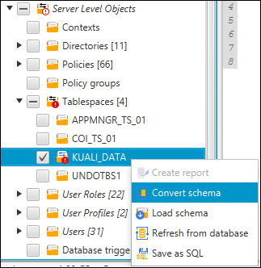
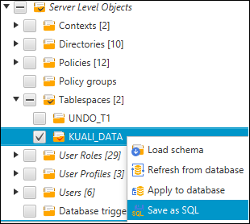

On the left side of the window will be listed all of the schema objects  for the original oracle database. By default, all items will be selected. Uncheck all of the items except for the "KUALI_DATA" tablespace item. Select "Convert schema" from the context menu of the table space item This should cause a corresponding "KUALI_DATA" tablespace item to  appear among the left side schema objects for the rds oracle database.

