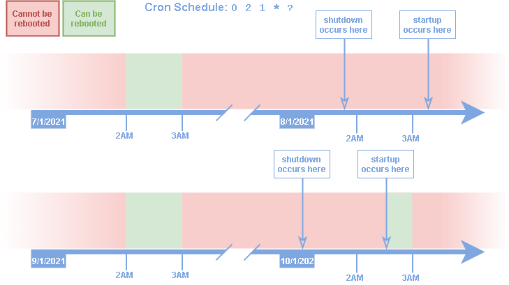

## Automated shutdown and startup for Kuali resources

Many resources like ec2 and RDS instances will not be needed at certain time during the day and week.
Such resources nonetheless continue to use up compute time during these times with the corresponding charges.
Knowing what these time frames are, it makes sense to shutdown the resources when they begin and to start them back up when they end.
This stack creates a single cloudwatch event that triggers at regular intervals a lambda function that checks for any and all resource that are tagged in such a way as to indicate a schedule for startup and shutdown.
Once having gathered the list of resources, the lambda will analyze the schedule of each and perform any startup/shutdown action if necessary.

**Entire stack diagram:**


**Lambda diagram:**


### Prerequisites:

- **AWS CLI:** 
  If you don't have the AWS command-line interface, you can download it here:
  [https://docs.aws.amazon.com/cli/latest/userguide/install-cliv2.html](https://docs.aws.amazon.com/cli/latest/userguide/install-cliv2.html)
- **IAM User/Role:**
  The cli needs to be configured with the [access key ID and secret access key](https://docs.aws.amazon.com/general/latest/gr/aws-sec-cred-types.html#access-keys-and-secret-access-keys) of an (your) IAM user. This user needs to have a role with policies sufficient to cover cloudformation stack create/update actions. Preferably your user will have an admin role and all policies will be covered.
- **Bash:**
  You will need the ability to run bash scripts. Natively, you can do this on a mac, though there may be some minor syntax/version differences that will prevent the scripts from working correctly. In that event, or if running windows, you can either:
  - Clone the repo on a linux box (ie: an ec2 instance), install the other prerequisites and run there.
  - Download [gitbash](https://git-scm.com/downloads)


### Steps:

Included is a bash helper script (main.sh) that serves to simplify many of the command line steps that would otherwise include a fair amount of manual entry. 

1. **Clone this repository**:

   ```
   git clone https://github.com/bu-ist/kuali-infrastructure.git
   cd kuali-infrastructure/kuali_shutdown
   ```

2. **Create the stack:**
   Use the helper script (main.sh) to create the cloudformation stack:

   You will always be presented with the final cli stack creation command so that you can look at all the parameters it contains and will have the option to abort. Saves fear of guesswork. Those parameters you don't see can be located in the yaml template for the default value.
   *NOTE: If creating this stack for kuali, it is recommended that you consider most of the default parameters.*

   ```
   # Uses npm to build, package and upload to s3 the node application the lambda will be based on, followed by stack creation.
   sh main.sh create-stack profile=[your profile]
   
   # Stack creation only (assumes the node application is already in s3 and is current)
   sh main.sh create-stack profile=[your profile] package_javascript=false
   
   # Delete and replace the stack (does not prompt for choices/input at any time)
   sh main.sh recreate-stack profile=[your profile]
   ```

3. **Tag your resources:**
   By default, a resource check is triggered by a cloudwatch event rule every 5 minutes.
   This resource check looks for resources tagged with the following:

   - **Service**: "research-administration"
   - **Function**: "kuali"

   Additionally, each resource found with these tags is checked for the following tags:

   - **LocalTimeZone**:
     The resource will be ignored without this tag set to an [IANA](https://www.iana.org/time-zones) timezone value. A valid value is any one [IANA TZ Database Timezone Name](https://en.wikipedia.org/wiki/List_of_tz_database_time_zones).
     For example, in Boston, our timezone name would be "America/New_York".

   - **StartupCron:**
     Following [cron-parser rules](https://www.npmjs.com/package/cron-parser), apply a cron expression to this tag that indicates when you want the resource started (if it is already running, it will be ignored.) Typically, this tag would have a "ShutdownCron" counterpart, but it is not required.
     As an example, to indicate startup for each business day at 6:15 AM, you would use the following cron expression:

     ```
     15 6 ? * MON-FRI
     ```

   - **ShutdownCron**:
     Following [cron-parser rules](https://www.npmjs.com/package/cron-parser), apply a cron expression to this tag that indicates when you want the resource stopped(if it is already stopped, it will be ignored.) Typically, this tag would have a "StartupCron" counterpart, but it is not required.
     As an example, to indicate shutdown for each business day at 8:00 PM, you would use the following cron expression: 

     ```
     0 20 ? * MON-FRI
     ```

   - **RebootCron:**
     Following [cron-parser rules](https://www.npmjs.com/package/cron-parser), apply a cron expression to this tag that indicates when you want the resource rebooted. The resource must be in a "RUNNING" state, else the reboot attempt is skipped. As an example, to indicate a reboot every Monday at 11PM use:

     ```
     0 23 ? * MON
     ```

     However, for less uniform schedules that cannot be reflected in one cron expression, this setting can have multiple entries. The first entry is can  have a key of either "RebootCron" or "RebootCron1", and every additional tag would have index of 2 or above (up to 10) at the end. So, for example, if you wanted a resource to be rebooted every 2nd and 4th Saturday at 2AM, you would use the following 2 cron expressions:

     ```
     RebootCron: 0 2 ? * SAT#2
     RebootCron2: 0 2 ? * SAT#4
     ```

   

   **Supported Cron format:** *(excerpted from cron-parser [documentation](https://www.npmjs.com/package/cron-parser))*

   ```
   # Supports mixed use of ranges and range increments (L and W characters are not supported currently)
   
   *    *    *    *    *    *
   ┬    ┬    ┬    ┬    ┬    ┬
   │    │    │    │    │    |
   │    │    │    │    │    └ day of week (0 - 7) (0 or 7 is Sun)
   │    │    │    │    └───── month (1 - 12)
   │    │    │    └────────── day of month (1 - 31, L)
   │    │    └─────────────── hour (0 - 23)
   │    └──────────────────── minute (0 - 59)
   └───────────────────────── second (0 - 59, optional)
   ```

   Example:

   An ec2 instance would be shut off from 9PM to 6AM and all day on weekends with the following tags:

   ```
   LocalTimeZone: America/New_York
   ShutdownCron: 0 21 ? * MON-FRI
   StartupCron 0 6 ? * MON-FRI
   ```

   

**Reboot window:**
Every time a resource is rebooted, it is also tagged with the date for the most recent reboot.
To be rebooted again, 2 criteria must be satisfied

1. The cron expression must indicate it is time to reboot the resource.
2. The last time the resource was rebooted (according to the corresponding tag) must have taken place BEFORE the two most recent scheduled reboot dates (according to the reboot cron expression).

From this you can see that, If for any reason, a resource with a reboot schedule had been kept shutdown during the time it would normally have been rebooted, it would be immediately rebooted after a restart. This would be redundant and confusing to the user.
Therefore, there is a 3rd criteria added that requires that a reboot must also take place within a one hour time window of its schedule.

A demonstration of this with the shutdown edge case is diagramed below for a 1st of the month at 2AM reboot cron schedule (0 2 1 * ?) :

