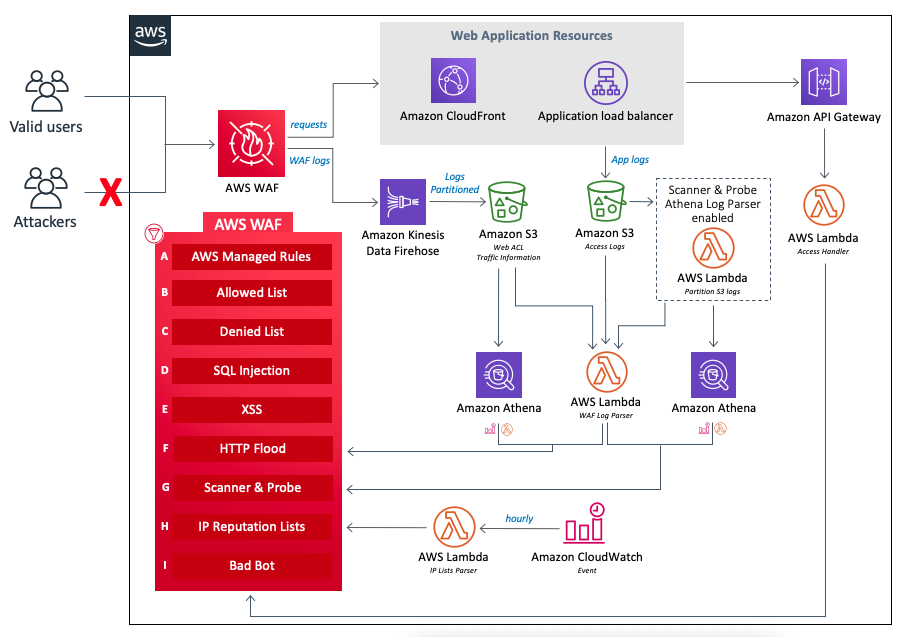

## Kuali Web Application Firewall

*Intended for inclusion as a nested stack in parent stacks - not as its own stack*

The cloudformation template here will create a [Web Application Firewall (WAF)](https://aws.amazon.com/waf/)

> *AWS WAF is a web application firewall that helps protect your web applications or APIs against common web exploits that may affect availability, compromise security, or consume excessive resources. AWS WAF gives you control over how traffic reaches your applications by enabling you to create security rules that block common attack patterns, such as SQL injection or cross-site scripting, and rules that filter out specific traffic patterns you define. You can get started quickly using Managed Rules for AWS WAF, a pre-configured set of rules managed by AWS or AWS Marketplace Sellers. The Managed Rules for WAF address issues like the OWASP Top 10 security risks.*

The firewall is based on the default configuration of the [aws-waf-security-automations.template](https://s3.amazonaws.com/solutions-reference/aws-waf-security-automations/v2.3.3/aws-waf-security-automations.template) which deploys an AWS WAF web ACL with eight preconfigured rules. In addition to this, 

1. An [Amazon Kinesis Data Firehose](https://docs.aws.amazon.com/firehose/latest/dev/what-is-this-service.html) is created to capture and stream WAF data into a data lake built on... 
2. [Amazon S3](https://docs.aws.amazon.com/AmazonS3/latest/dev/Welcome.html). Three separate S3 buckets in total are created.
3. An [AWS Glue](https://docs.aws.amazon.com/glue/latest/dg/what-is-glue.html) database is also created and used to catalog the S3 bucket content for analysis with tools like [Athena](https://docs.aws.amazon.com/athena/latest/ug/what-is.html) or [Redshift](https://docs.aws.amazon.com/redshift/latest/mgmt/welcome.html).

### Why do we need a WAF?

Without a WAF, any application sitting behind a publicly available load balancer whose ports (typically 80 and 443) with global cidr IP access (`0.0.0.0/0`),  is not looking at http requests as potentially containing attacks.
NAT provides some security for unsolicited traffic, but the ALBs are sitting in public subnets and servicing public requests which need to prove they are not dangerous by obeying the rules configured into the WAF.

Alternatively, the only way to provide enough protection without a WAF is to restrict the security groups associated to the ALB to allow only traffic from cidr IP ranges of BU VPNs. This however would take the application out of the public category as one would need to be logged on to the BU network in order to access the app (no "coffee shop" access).

### Architecture:

*Note: Of the two "Web Application Resources" choices depicted below, our implementation used the [ALB](https://docs.aws.amazon.com/elasticloadbalancing/latest/application/introduction.html), not [cloudfront](https://docs.aws.amazon.com/AmazonCloudFront/latest/DeveloperGuide/Introduction.html).* 



### Kuali specific adjustments:

- **Lambda function to turn on WAF logging**:
  A cloudformation resource for [WAF](https://docs.aws.amazon.com/waf/latest/developerguide/waf-chapter.html) does not come with an attribute for logging to be turned on automatically.
  However, this can be done on an existing [WAF](https://docs.aws.amazon.com/waf/latest/developerguide/waf-chapter.html) using the CLI, API, or the management console. To automate this as part of stack creation, a [custom resource](https://docs.aws.amazon.com/AWSCloudFormation/latest/UserGuide/template-custom-resources.html) is used to invoke a lambda function written with an API call to turn on logging after the [WAF](https://docs.aws.amazon.com/waf/latest/developerguide/waf-chapter.html) has been created.
  
- **Lambda function to cleanup S3 after stack deletion:**
  In most cases it is desirable to have a stack fully "clean up after itself" when being deleted. However, for S3 buckets to be included in this cleanup, they first need to be emptied. A [custom resource](https://docs.aws.amazon.com/AWSCloudFormation/latest/UserGuide/template-custom-resources.html) is included in the main application stack that invokes a lambda function to:
  
  1. Turn off logging for the [ALB](https://docs.aws.amazon.com/elasticloadbalancing/latest/application/introduction.html). The load balancer is configured to have an S3 bucket capture logs of its activity. If bucket were to be emptied without first disabling the logging, it would start to fill up again before the deletion attempt could be made. This will cause the stack deletion to fail
  2. Turn off logging for the [WAF](https://docs.aws.amazon.com/waf/latest/developerguide/waf-chapter.html). The is done for the same reason it is done for the ALB.
  3. Empty the ALB logs bucket of content
  4. Empty the WAF logs bucket of content
  5. These buckets were created with a retention policy of delete, so cloudformation will do the rest (and delete the buckets).
  
- **Modified WAF WebAcl to adjust AWS-AWSManagedRulesCommonRuleSet rules**:
  Out-of-the-box, the AWS WAF Security Automations stack deploys, among other rules, a "common" rule set of 22 rules.
  5 of these rules cause false-positive blocks to the application, resulting in 403 status codes in the browser:
  
  1. **CrossSiteScripting_COOKIE**: Inspects the value of cookie headers and blocks common cross-site scripting (XSS) patterns using the built-in XSS detection rule in AWS WAF. Example patterns include scripts like `<script>alert("hello")</script>`.
  2. **SizeRestrictions_BODY**: Verifies that the request body size is within the bounds common for many applications.
  3. **GenericRFI_BODY**: Inspects the values of the request body and blocks requests attempting to exploit RFI (Remote File Inclusion) in web applications. Examples include patterns like `://`.
  4. **GenericRFI_QUERYARGUMENTS**: Inspects the values of all query parameters and blocks requests attempting to exploit RFI (Remote File Inclusion) in web applications. Examples include patterns like `://`.
  5. **NoUserAgent_HEADER**: Blocks requests with no HTTP User-Agent header.
  
  While these modifications can be made manually through the AWS console once the standard [template](https://s3.amazonaws.com/solutions-reference/aws-waf-security-automations/latest/aws-waf-security-automations.template) from AWS has been run and the WAF created, keeping the entire stack creation process automated is a goal and so this same template has been downloaded and modified to turn off these 5 rules. Any other custom rules can added against this copy. This means that checks should be made by routine to determine if the original template from AWS has changed with additions or updates so they can be pulled and merged with the copy.
  
  ```
  # Clone this repository.
  cd kuali_waf
  
  # curl in two of the standard templates.
  curl https://s3.amazonaws.com/solutions-reference/aws-waf-security-automations/latest/aws-waf-security-automations.template \
  -o aws-waf-security-automations.template
  curl https://s3.amazonaws.com/solutions-reference/aws-waf-security-automations/latest/aws-waf-security-automations-webacl.template \
  -o aws-waf-security-automations-webacl.template
  
  # Updates made to these standard templates should be easy enough to tell apart from the overridding customizations.
  diff aws-waf-security-automations.template aws-waf-security-automations-custom.yaml
  diff aws-waf-security-automations-webacl.template aws-waf-security-automations-webacl-custom.yaml
  ```

### Upload the template to S3:

Any updates to the template should be followed by an upload to s3 to keep things in sync:

```
cd kuali_waf
sh upload.sh profile=[your profile]
```

### Additional links/documentation:

- [AWS WAF security automations source code](https://github.com/awslabs/aws-waf-security-automations)
  This is a useful for answering certain specific questions as to how the WAF stack works.
- [AWS Managed Rules rule groups list](https://docs.aws.amazon.com/waf/latest/developerguide/aws-managed-rule-groups-list.html)
  Describes each of the rules in the AWS security automations rules group list.
- [Working with managed rule groups](https://docs.aws.amazon.com/waf/latest/developerguide/waf-using-managed-rule-groups.html)
  Describes how to override rules in a managed rule group.
- [aws-waf-and-shield-advanced-developer-guide](https://github.com/awsdocs/aws-waf-and-shield-advanced-developer-guide)
  Contains tons of in depth documentation on WAF specifics.
- [How can I detect false positives caused by AWS Managed Rules and add them to a safe list?](https://aws.amazon.com/premiumsupport/knowledge-center/waf-detect-false-positives-from-amrs/)


### Kuali-specific Rule(s):

A specific service-to-service https request made by rice for user information gets blocked by the WAF as is.
The relevant part of the stack trace looks like this:

```
Caused by: org.apache.cxf.transport.http.HTTPException: HTTP response '403: Forbidden' when communicating with https://stg.kualitest.research.bu.edu/kc/remoting/soap/kim/v2_0/identityService
	at org.apache.cxf.transport.http.HTTPConduit$WrappedOutputStream.doProcessResponseCode(HTTPConduit.java:1618) ~[cxf-rt-transports-http-3.3.5.jar:3.3.5]
	at org.apache.cxf.transport.http.HTTPConduit$WrappedOutputStream.handleResponseInternal(HTTPConduit.java:1625) ~[cxf-rt-transports-http-3.3.5.jar:3.3.5]
	at org.apache.cxf.transport.http.HTTPConduit$WrappedOutputStream.handleResponse(HTTPConduit.java:1570) ~[cxf-rt-transports-http-3.3.5.jar:3.3.5]
	at org.apache.cxf.transport.http.HTTPConduit$WrappedOutputStream.close(HTTPConduit.java:1371) ~[cxf-rt-transports-http-3.3.5.jar:3.3.5]
	at org.apache.cxf.transport.AbstractConduit.close(AbstractConduit.java:56) ~[cxf-core-3.3.5.jar:3.3.5]
	at org.apache.cxf.transport.http.HTTPConduit.close(HTTPConduit.java:671) ~[cxf-rt-transports-http-3.3.5.jar:3.3.5]
	at org.apache.cxf.interceptor.MessageSenderInterceptor$MessageSenderEndingInterceptor.handleMessage(MessageSenderInterceptor.java:63) ~[cxf-core-3.3.5.jar:3.3.5]
	...
```

The WAF log includes the following entry that explains the blockage: [log entry](WAF_Blocked_Request.json)

For some reason the `CrossSiteScripting_BODY` rule in `AWS-AWSManagedRulesCommonRuleSet` doesn't like the `"xmlns:soap"` attribute value of: `"http://schemas.xmlsoap.org/soap/envelope/"`
SOAP endpoints can be used to send DOM Objects and suspicious data/script which can comprise an XSS attack. This possibility is picked up by the XssRule and the url is blocked. However it is a necessary http request without which the application fails at the REST level. So, it needs to be allowed.
Therefore the following modifications are made:

- A custom "Rice-Identity-Service-Rule" rule is added that bypasses XSS Body blocking for requests containing `"remoting/soap/kim/v2_0/identityService"` in the URI. Everything else is blocked if it was labelled by the CrossSiteScripting_BODY rule - its blocking was turned off, but it would still label the request if a match was found that would have otherwise been a blocker. Obviously for this to work, the CrossSiteScripting_BODY needs to be higher in priority so that it can run first in order to apply the label
- The AWS-AWSManagedRulesCommonRuleSet.CrossSiteScripting_BODY rule is deactivated (set to "COUNT").
  This will prevent interference with the exception in the Rice-Identity-Service-Rule. The Rice-Identity-Service-Rule will re-engage the rule if its own exception has been satisfied.
- *NOTE: The Main XssRule is deactivated because due to redundancy - the same actions & criterion are duplicated in AWSManagedRulesCommonRuleSet.*