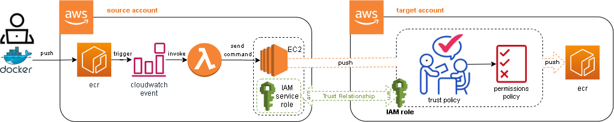

## Synchronize Kuali ECR with CSS ECR

**Terms:**

- **"legacy"**: This will refer to the [aws account](https://buaws-kuali.signin.aws.amazon.com/console) that the kuali application has been running in since 2016
- **"CSS"**: This will refer to the ["Common security services" aws account](https://github.com/bu-ist/buaws-istcloud-infrastructure) that the kuali application is to be moved to.

Moving the kuali application from its current legacy account to the CSS account is being done one environment at a time. This starts with the "CI", or dev environment. With the dev environment resituated in the CSS account, all docker images that get built will go to the container registry in that new account.

**Problem:** However, the other environments remaining in the legacy account will have no "knowledge" of this and will continue to base deploy actions on docker images local to the ecr in that account.

**Solution:** Therefore, the answer is to ship any new images deposited in the CSS ecr account to the legacy ecr account.
This way, all development and change activity can occur in the new account and be available in the old account.
This scenario is usually accommodated with the [Private Image Replication Service](https://docs.aws.amazon.com/AmazonECR/latest/userguide/replication.html). However, the repositories that correspond to each other between accounts don't share an identical name. That is, for example, the *"coeus"* repository in the legacy ecr has a counterpart in the target CSS account called *"kuali-coeus"*. This seems to be a barrier to using [Private Image Replication](https://docs.aws.amazon.com/AmazonECR/latest/userguide/replication.html) due to the replication being based on repository name identity.

To get around this, an alternative replication approach can be performed by a cloudwatch/lambda/ec2 combination.
For that, two stack templates are provided here:

-  A **"Trusted"** account stack comprising: 
  - A [Cloudwatch events rule](https://docs.aws.amazon.com/AWSCloudFormation/latest/UserGuide/aws-resource-events-rule.html).
    This events rule is activated on pushes to the ecr registry in the *"kuali-coeus"* and *"kuali-coeus-feature"* repositories. 
  - A [Lambda function](https://docs.aws.amazon.com/AWSCloudFormation/latest/UserGuide/aws-resource-lambda-function.html).
    This function is triggered by the event rule and executes a systems manager send command call to an ec2 instance, passing along parameters from the event rule to identify what image was pushed.
  - An [EC2 Instance](https://docs.aws.amazon.com/AWSCloudFormation/latest/UserGuide/aws-properties-ec2-instance.html).
    The replication is handled by a custom bash script stored on the ec2 instance. The bash script uses docker, the aws cli and some repository name mapping logic and the final replication *(pull docker image from source account and push it to target account)*.
  - An [IAM Role](https://docs.aws.amazon.com/AWSCloudFormation/latest/UserGuide/aws-resource-iam-role.html).
    This role is provided with the arn of a counterpart role
- A **"Trusting"** account stack comprising:
  - An IAM Role
    This role establishes a trust relationship with the trusted account. As such it comprises 2 policies:
    - The *permissions policy* grants the user of the role the needed permissions to carry out the actions against the ECR repositories.
    - The *trust policy* specifies which trusted account members are allowed to assume the role. In this case, the trusted member would be the role created in the "Trusted" account for the ec2 instance profile.



### Steps:

1. Create the "Trusted" account resources:

   ```
   cd lambda/ecr_sync
   sh main.sh create-stack \
     profile=[profile of trusted account] \
     sync_participant=source \
     trusting_account=730096353738 \
     landscape=stg
   ```

   When the stack has finished creating, all resources will have been created, EXCEPT the delegating trust policy that specifies the trusting role in the target account, which hasn't been created yet.
   This stack will have a single output specifying the arn of the role it created.

   > **Landscape Parameter:** You can omit the landscape parameter if there will only be one deployed stack in the account.
   > This will simplify resource names in that they will have a landscape qualifier omitted. If you do this, you must also omit the Landscape parameter when building the "Trusting" account role stack in the target account *(Next step)*

2. Create the "Trusting" account role:

   ```
   sh main.sh create-stack \
     profile=[profile of trusting account] \
     sync_participant=target \
     trusted_account=770203350335 \
     landscape=stg
   ```

   This stack will also have a single output specifying the arn of the role it created.

4. Test by uploading a dummy image to the trusted account coeus-feature repository (then remove it):

   ```
   docker pull busybox
   
   docker tag busybox:latest 770203350335.dkr.ecr.us-east-1.amazonaws.com/kuali-coeus-feature:busybox
   
   aws ecr get-login-password \
     --region us-east-1 | docker login \
       --username AWS \
       --password-stdin 770203350335.dkr.ecr.us-east-1.amazonaws.com
       
   docker push 770203350335.dkr.ecr.us-east-1.amazonaws.com/kuali-coeus-feature:busybox
   ```

   "busybox" tagged versions of the "coeus-feature" repository should appear in the trusting account ecr moments later.
   
   **Unit Test:**
   You can also "unit test" by invoking the lambda function directly *(does not need to be triggered by event)*.
   You can do this in one of two ways:
   
   1. "Impersonate" the EventBridge service by calling the lambda function directly with the cli:
   
      ```
      local reponame=${1:-"kuali-coeus-feature"}
      local imagetag=${2:-"busybox"}
      local digest=${3:-"unknown-digest"}
      aws lambda invoke \
        --function-name research-administration-kuali-prod-ecr-sync \
        --cli-binary-format raw-in-base64-out \
        --payload '
          {
            "version": "0",
            "id": "13cde686-328b-6117-af20-0e5566167482",
            "detail-type": "ECR Image Action",
            "source": "aws.ecr",
            "account": "770203350335",
            "time": "2022-06-09T00:00:00Z",
            "region": "us-east-1",
            "resources": [],
            "detail": {
              "result": "SUCCESS",
              "repository-name": "'$reponame'",
              "image-digest": "sha256:'$digest'",
              "action-type": "PUSH",
              "image-tag": "'$imagetag'"
            }
          }' \
        lambda-test.json
      ```
   
      Change the field values appropriately and run the test. The corresponding image should show up in the target repository.
   
   2. Bring the lambda function up in the aws management console and navigate as follows:
   
      - Navigate here: `"Test" tab --> "Create new event" --> "Event JSON":`
      - Paste the same json used in the --payload field of the cli example above into the "Event JSON" field.
      - Change the field values appropriately and run the test. The corresponding image should show up in the target repository.
   

#### References:

- [Create reusable Assume role script for Cross-Account AWS access](https://towardsthecloud.com/create-reusable-assume-role-script-cross-account-aws)
- [How do I configure a Lambda function to assume an IAM role in another AWS account?](https://aws.amazon.com/premiumsupport/knowledge-center/lambda-function-assume-iam-role/) 
  *(In this case, not a Lambda function, but an ec2 instance)*

