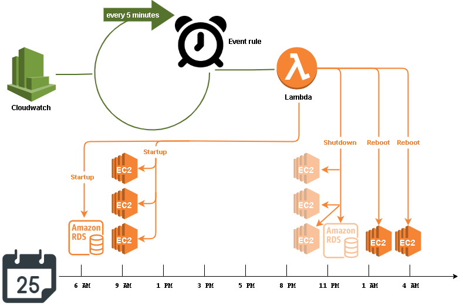
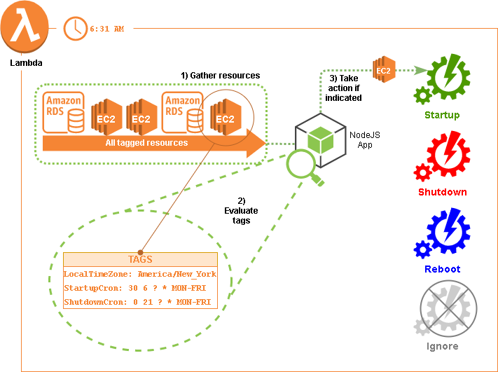

## Automated shutdown, startup and reboot for AWS resources

Many resources like ec2 and RDS instances will not be needed at certain time during the day and week.
Such resources nonetheless continue to use up compute time during these times with the corresponding charges.
Knowing what these time frames are, it makes sense to shutdown the resources when they begin and to start them back up when they end.
This stack creates a single cloudwatch event that triggers at regular intervals (ie: every 5 minutes) a lambda function that checks for any and all resource that are tagged in such a way as to indicate a schedule for startup and shutdown or reboot.
Once having gathered the list of resources, the lambda will analyze the schedule of each and perform any startup/shutdown action if necessary.



**No centralized Scheduling:** A common way to implement scheduled events like this is to create an cloudwatch rule for each one. In that scenario, the cron expression that drives the schedule is the one defined for the event rule. Targeting AWS resources is a matter of tagging them with an identifier that the lambda function would be looking for. This is a one (schedule) to many (resource) relationship.

**Decentralized Scheduling:** However, a polling model is used here. There is only one event rule and it runs on a regular frequent schedule. AWS resources still have to be tagged for the lambda function to consider them, but these tags have values that are themselves cron expressions. This way, each AWS resource indicates its own schedule for being started, stopped, or rebooted, and not dictated to by an exterior source.
This is a one (schedule) to one (resource) relationship.



**Localized Timezone:** The lambda function evaluates the cron expressions on the each resource using the [cron-parser](https://www.npmjs.com/package/cron-parser) library. For this reason, those cron expressions do not have to follow AWS cron rules, but can follow more standard cron convention.

```
# Supports mixed use of ranges and range increments (L and W characters are not supported currently)

*    *    *    *    *    *
┬    ┬    ┬    ┬    ┬    ┬
│    │    │    │    │    |
│    │    │    │    │    └ day of week (0 - 7) (0 or 7 is Sun)
│    │    │    │    └───── month (1 - 12)
│    │    │    └────────── day of month (1 - 31, L)
│    │    └─────────────── hour (0 - 23)
│    └──────────────────── minute (0 - 59)
└───────────────────────── second (0 - 59, optional)
```

Also, these cron expressions do not have to be in UTC time, but can be in your own timezone.
Therefore resources will be ignored without a "LocalTimeZone" tag set to an [IANA](https://www.iana.org/time-zones) timezone value. A valid value is any one [IANA TZ Database Timezone Name](https://en.wikipedia.org/wiki/List_of_tz_database_time_zones). For example, in Boston, our timezone name would be "America/New_York".

**Example:**
An EC2 instance that needs to be running between the hours of 7:30AM and 9:00PM weekdays and rebooted on the 2nd and 4th Saturdays of the month at 2AM would be tagged as follows:

```
LocalTimeZone: America/New_York
StartupCron: 30 7 ? * MON-FRI
ShutdownCron 0 21 ? * MON-FRI
RebootCron: 0 2 ? * SAT#2
RebootCron2: 0 2 ? * SAT#4 
```


### Local running/debugging:

These instructions are for testing lambda code written in nodejs locally.

**Requirements:**

- [Visual Studio Code](https://code.visualstudio.com/download)
- [Node.js runtime](https://nodejs.org/en/download/)
- [Npm](https://www.npmjs.com/get-npm) *(Note: you get this automatically with the Nodejs installation)*
- **IAM User/Role:**
  The cli needs to be configured with the [access key ID and secret access key](https://docs.aws.amazon.com/general/latest/gr/aws-sec-cred-types.html#access-keys-and-secret-access-keys) of an (your) IAM user. This user needs to have a role with policies sufficient to cover all of the actions to be carried out by the nodejs code for the lambda function (starting, stopping, rebooting, tagging resources). Preferably your user will have an admin role and all policies will be covered.
- **Bash:**
  You will need the ability to run bash scripts. Natively, you can do this on a mac, though there may be some minor syntax/version differences that will prevent the scripts from working correctly. In that event, or if running windows, you can either:
  - Clone the repo on a linux box (ie: an ec2 instance), install the other prerequisites and run there.
  - Download [gitbash](https://git-scm.com/downloads)

**Steps:**

1. **Clone this repository**

   ```
   git clone https://github.com/bu-ist/kuali-infrastructure.git
   ```

2. **Install dependencies**
   
   ```
cd lambda/shutdown_scheduler
   npm install
```
   
*NOTE: You may want to remove the [package-lock.json](https://docs.npmjs.com/cli/v7/configuring-npm/package-lock-json) file first.*
   
3. **Create a launch configuration**
   To debug the lambda code as a local nodejs app, create a new or extend the existing .vscode [launch.json](https://code.visualstudio.com/docs/editor/debugging#_launchjson-attributes) file.
   There are 3 configurations below:

   1. **Mocked**: 

      The launch configuration starts in a "local_mocked" DEBUG_MODE that imports a mocked aws sdk that returns mocked AWS api call return objects. 

   2. **Unmocked**:

      The launch configuration starts in a "local_unmocked" DEBUG_MODE that imports the actual aws sdk, which means that the AWS api calls apply to whatever cloud account your profile indicates. Use this as a trial run before deploying somewhere like a lambda function, but keep in mind that the time zones will be different (lambda functions always run in the UTC time zone).

   ```
       {
         "env": {
           "DEBUG_MODE": "local_unmocked",
           "AWS_SDK_LOAD_CONFIG": "1",
           "AWS_PROFILE": "[your profile in ~/.aws/config]",
           "StartupCronKey": "StartupCron",
           "ShutdownCronKey": "ShutdownCron",
           "TimeZoneKey": "LocalTimeZone",
           "RebootCronKey": "RebootCron",
           "LastRebootTimeKey": "LastRebootTime",
           "DefaultTimeZone": "America/New_York"
         },
         "cwd": "${workspaceFolder}/lambda/shutdown_scheduler",
         "name": "Shutdown scheduler unmocked",
         "type": "node",
         "request": "launch",
         "program": "debug.js"
       },
       {
         "env": {
           "DEBUG_MODE": "local_mocked",
           "AWS_SDK_LOAD_CONFIG": "1",
           "AWS_PROFILE": "[your profile in ~/.aws/config]",
           "StartupCronKey": "StartupCron",
           "ShutdownCronKey": "ShutdownCron",
           "TimeZoneKey": "LocalTimeZone",
           "RebootCronKey": "RebootCron",
           "LastRebootTimeKey": "LastRebootTime"
         },
         "cwd": "${workspaceFolder}/lambda/shutdown_scheduler",
         "name": "Shutdown scheduler mocked",
         "type": "node",
         "request": "launch",
         "program": "debug.js"
       } 
   
   ```

   For the unmocked launch configuration, all resources will be ignored unless they are tagged with the following:

   - LocalTimeZone
   - StartupCron and/or ShutdownCron

   or...

   - LocalTimeZone
   - RebootCron[1-10]

   or a combination:

   - LocalTimeZone
   - StartupCron and/or ShutdownCron
   - RebootCron[1-10]

4. **Debug**
   Put break points where they need to be and run one of the launch configurations following vscode [debugging documentation](https://code.visualstudio.com/docs/editor/debugging)

