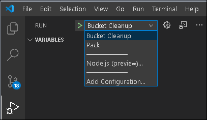

## Lambda Function: *Remove S3 Buckets*

A stack delete operation will fail if any logging has been enabled for the [ALB](https://docs.aws.amazon.com/elasticloadbalancing/latest/application/introduction.html) or [WAF](https://docs.aws.amazon.com/waf/latest/developerguide/waf-chapter.html).
Cloud-formation will not delete s3 buckets with contents in them - the stack delete operation will fail if they have any.
The AWS CLI can be used as part of bash operation that issues the stack command to first empty the buckets that receive the logging.
However, after being emptied, these buckets continue to receive logging that occurs until the ALB and WAF resources themselves are deleted.
The related s3 buckets still fail to get deleted since they took on additional content in this small time window and the stack operation fails.
Therefore, logging must also be disabled for the [ALB](https://docs.aws.amazon.com/elasticloadbalancing/latest/application/introduction.html) and [WAF](https://docs.aws.amazon.com/waf/latest/developerguide/waf-chapter.html). This lambda function does both (disables logging and empties buckets).

*NOTE: Logging disablement and bucket clearing could be both be done with the cli, though such scripting is starting to pile up.*

### Local running/debugging:

These instructions are for testing lambda code written in nodejs locally.

**Requirements:**

- [Visual Studio Code](https://code.visualstudio.com/download)
- [Node.js runtime](https://nodejs.org/en/download/)
- [Npm](https://www.npmjs.com/get-npm) *(Note: you get this automatically with the Nodejs installation)*
- **IAM User/Role:**
  The cli needs to be configured with the [access key ID and secret access key](https://docs.aws.amazon.com/general/latest/gr/aws-sec-cred-types.html#access-keys-and-secret-access-keys) of an (your) IAM user. This user needs to have a role with policies sufficient to cover all of the actions to be carried out by the nodejs code for the lambda function (disabling logging on [ALB](https://docs.aws.amazon.com/elasticloadbalancing/latest/application/introduction.html) and [WAF](https://docs.aws.amazon.com/waf/latest/developerguide/waf-chapter.html)). Preferably your user will have an admin role and all policies will be covered.
- **Bash:**
  You will need the ability to run bash scripts. Natively, you can do this on a mac, though there may be some minor syntax/version differences that will prevent the scripts from working correctly. In that event, or if running windows, you can either:
  - Clone the repo on a linux box (ie: an ec2 instance), install the other prerequisites and run there.
  - Download [gitbash](https://git-scm.com/downloads)

**Steps:**

1. **Clone this repository**

   ```
   git clone https://github.com/bu-ist/kuali-infrastructure.git
   ```

2. **Create a launch configuration**

   ```
   cd kuali-infrastructure
   mkdir .vscode
   cat <<EOF > .vscode/launch.json
   {
     "version": "0.2.0",
     "configurations": [
       {
         "env": {
           "MODE": "unmocked",
           "AWS_SDK_LOAD_CONFIG": "1",
           "AWS_PROFILE": "[profile, unless default]",
           "LANDSCAPE": "ci"
         },
         "cwd": "${workspaceFolder}/lambda/pre-alb-delete",
         "name": "Bucket Cleanup",
         "type": "node",
         "request": "launch",
         "program": "debug.js",
         "args": [ 
           "{resource:'waf', target:'bucket'}" 
         ]
       },
       {
         "cwd": "${workspaceFolder}/lambda/pre-alb-delete",
         "name": "Pack",
         "type": "node",
         "request": "launch",
         "program": "zip.js",
       },
     ]
   }
   EOF
   ```

3. **Launch a debug session:**
   Open the vscode debug view: `Ctrl+Shift+D` 
   You should see the names of the launch configurations from the launch.json file as picklist selections.
   Pick "Bucket Cleanup" and click the green arrow. If you have put a breakpoint in any of the code, you can step through it.


   
       

4. **Package the code for lambda**
   When creating a lambda backed custom resource in cloud-formation, you can include the code inline:

   ```
     WafLambda:
       Type: AWS::Lambda::Function
       Properties:
         ...
         Code:
           ZipFile: |
             [inline code]
   ```

   or, you can reference a zip file in a s3 bucket:

   ```
     AlbWafLoggingCleanupLambda:
       Type: AWS::Lambda::Function
       Properties:
         ...
         Code:
           S3Bucket: !Ref TemplateBucketName
           S3Key: cloudformation/kuali_lambda/cleanup.zip
   
   ```

   To create this zip file, invoke the other launch configuration "Pack".
   This will create the zip file within the same directory.
   You can load this zip file into s3 corresponding to the custom resource "S3Bucket" and "S3Key" properties.
   This should happen automatically, however, when the main stack creation/update script is run - it will look for a "cleanup.zip" file in this location, or create it if not found, and upload it to s3.

### References:

- [Building Lambda functions with Node.js](https://docs.aws.amazon.com/lambda/latest/dg/lambda-nodejs.html)
- [Node.js tutorial in Visual Studio Code](https://code.visualstudio.com/docs/nodejs/nodejs-tutorial)